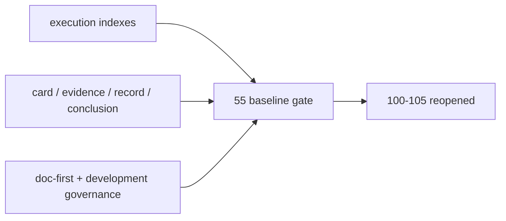

# pre-trade upstream data-grade baseline gate 证据
`证据编号`：`55`
`日期`：`2026-04-14`

## 实现与验证命令

1. `python .codex/skills/lifespan-execution-discipline/scripts/check_execution_indexes.py --include-untracked`
   - 结果：通过
   - 说明：`55` 的 `card / evidence / record / conclusion` 已补齐，`54 -> 55 -> 100` 的执行索引闭环已更新。
2. `python scripts/system/check_doc_first_gating_governance.py`
   - 结果：通过
   - 说明：`55` 仍保持设计 / 规格 / card 先行的正式门禁口径。
3. `python scripts/system/check_development_governance.py docs/03-execution/55-pre-trade-upstream-data-grade-baseline-gate-card-20260413.md docs/03-execution/55-pre-trade-upstream-data-grade-baseline-gate-evidence-20260414.md docs/03-execution/55-pre-trade-upstream-data-grade-baseline-gate-record-20260414.md docs/03-execution/55-pre-trade-upstream-data-grade-baseline-gate-conclusion-20260414.md docs/03-execution/B-card-catalog-20260409.md docs/03-execution/C-system-completion-ledger-20260409.md docs/03-execution/00-conclusion-catalog-20260409.md`
   - 结果：通过
   - 说明：按本次改动范围做硬闸门检查，通过，且没有引入新的治理违规。
4. `python scripts/system/check_development_governance.py`
   - 结果：未通过
   - 说明：全仓扫描仍报告既有文件长度债，命中的主要是与本次 55 文档收口无关的历史代码文件，因此本卡不把全仓扫描结果作为放行依据。

## 冻结事实

1. `55` 是进入 `100-105` 之前的最后一道 upstream baseline gate。
2. `data -> malf -> structure -> filter -> alpha -> position -> portfolio_plan` 已在前序结论中完成各自正式账本闭环。
3. `portfolio_plan` 已具备正式 data-grade runner、独立 `work_queue / checkpoint / replay / freshness_audit`，足以作为 `55` 的最后裁决输入。
4. 通过 `55` 后，`100-105` 的 trade/system 卡组可以恢复推进，但不等于 broker/live runtime 已经上线。

## 证据结构图

