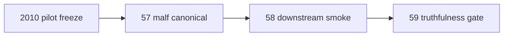

# mainline official middle-ledger 2010 pilot scope freeze 卡
`卡号`：`56`
`日期`：`2026-04-14`
`状态`：`已完成`

## 需求

- 问题：`malf canonical v2` 已在代码与单测中成立，但 `H:\Lifespan-data` 正式库尚未完成真实落地，主线仍停在 bridge-v1。
- 目标结果：冻结 `2010-01-01 ~ 2010-12-31` pilot 的正式时间窗口、正式库路径、模块范围、执行命令边界与收口标准。
- 为什么现在做：如果不先冻结 pilot 范围，就无法合法进入真实正式库 bootstrap，也无法为后续三年一段建库提供统一模板。

## 设计输入

- 设计文档：`docs/01-design/modules/system/17-official-middle-ledger-phased-bootstrap-and-real-data-pilot-charter-20260414.md`
- 规格文档：`docs/02-spec/modules/system/17-official-middle-ledger-phased-bootstrap-and-real-data-pilot-spec-20260414.md`

## 任务分解

1. 冻结 `2010-01-01 ~ 2010-12-31` 的 pilot 日期窗口。
2. 冻结 `malf / structure / filter / alpha` 的正式库路径、临时产物目录与报告出口。
3. 给出 `57 / 58 / 59` 的正式命令草案、执行边界与收口标准。

## 实现边界

- 范围内：pilot 年份、正式路径、模块范围、命令边界、报告出口。
- 范围外：真实写库、downstream 物化、truthfulness gate 裁决。

## 历史账本约束

- 实体锚点：`malf` 使用 `asset_type + code + timeframe`，`structure / filter / alpha` 默认使用 `asset_type + code + timeframe='D'`。
- 业务自然键：沿用各模块既有 canonical / snapshot / event 自然键，`run_id` 只保留审计职责。
- 批量建仓：本卡只冻结 `2010` 全年 pilot 范围，不执行真实批量建仓。
- 增量更新：`2010` 之后的窗口推进由 `60-65` 接续，本卡只定义节奏与边界。
- 断点续跑：`57-65` 必须继续服从 queue/checkpoint/replay 语义，本卡不允许临时全量重跑替代正式续跑。
- 审计账本：本卡的裁决与边界通过 execution evidence / record / conclusion 闭环沉淀。

## 收口标准

1. `2010` pilot 范围冻结完成。
2. `57-59` 的正式路径与命令草案写清。
3. evidence / record / conclusion 模板入口可以直接复用。
4. 索引与路线图已把当前待施工卡切到 `56`。

## 卡片结构图

