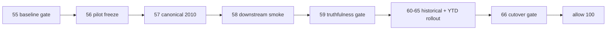

# mainline official middle-ledger 2010 pilot scope freeze 结论
`结论编号`：`56`
`日期`：`2026-04-14`
`状态`：`已完成`

## 裁决

- 接受：`2010-01-01 ~ 2010-12-31` 被正式冻结为真实正式库 middle-ledger 落地 pilot。
- 接受：`56 -> 59 -> 60 -> 66 -> 78 -> 84` 被正式插入到 `55` 与 `100` 之间，成为恢复 trade/system 之前的新增前置卡组。
- 接受：当前待施工卡不再停留在 `56`，而是前移到 `57-malf-canonical-official-2010-bootstrap-and-replay-card-20260414.md`。
- 拒绝：把 `55` 解释为已经可以直接恢复 `100 -> 105`，因为真实正式库 canonical cutover 仍未落地。

## 原因

1. 当前仓库的代码真值与真实正式库状态已经分叉。
   - 代码 / 单测主线已经切到 `malf canonical v2`
   - `H:\Lifespan-data` 实际主线仍停在 bridge-v1
2. 需要先用小范围 pilot 验证真实正式库落地路径。
   - `2010` 全年窗口足以覆盖 bounded bootstrap、queue/checkpoint/replay、downstream rebind 与 truthfulness gate
   - 先做 `2010`，可以把真实成本控制在可验证范围内
3. 后续历史建库节奏已经被正式固定。
   - `80 -> 84` 依次覆盖 `2011-2013`、`2014-2016`、`2017-2019`、`2020-2022`、`2023-2025`
   - `95` 承接 `2026 YTD`
   - `96` 才裁决是否允许恢复 `100`

## 影响

1. 当前最新生效结论锚点推进到 `56-mainline-official-middle-ledger-2010-pilot-scope-freeze-conclusion-20260414.md`。
2. 当前待施工卡前移到 `57-malf-canonical-official-2010-bootstrap-and-replay-card-20260414.md`。
3. 主线施工顺序更新为 `... -> 55 -> 56 -> 57 -> 58 -> 59 -> 60 -> 61 -> 62 -> 63 -> 64 -> 65 -> 66 -> 78 -> 79 -> 80 -> 81 -> 82 -> 83 -> 84 -> 100 -> ... -> 105`。
4. `100 -> 105` 继续冻结，直到 `96` 明确放行。

## 六条历史账本约束检查

| 项目 | 当前状态 | 说明 |
| --- | --- | --- |
| 实体锚点 | 已满足 | `56` 只冻结 pilot 边界，仍沿用各模块正式实体锚点，不引入临时主语义。 |
| 业务自然键 | 已满足 | `56` 沿用既有 canonical / snapshot / event 自然键，不允许用 `run_id` 替代。 |
| 批量建仓 | 已满足 | `56` 已明确 `2010` pilot 与 `80 -> 84` 三年窗口的分段建仓节奏。 |
| 增量更新 | 已满足 | `95` 被明确指定为 `2026 YTD` 正式增量对齐卡。 |
| 断点续跑 | 已满足 | `57 -> 65` 被明确要求继续服从 queue/checkpoint/replay 口径。 |
| 审计账本 | 已满足 | `56` 已补齐 `card / evidence / record / conclusion` 并要求后续窗口卡继续闭环。 |

## 结论结构图

