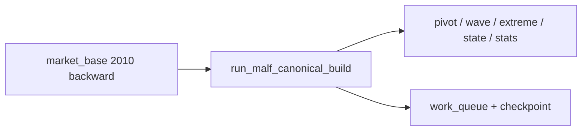

# malf canonical official 2010 bootstrap and replay 卡
`卡号`：`57`
`日期`：`2026-04-14`
`状态`：`已完成`

## 需求

- 问题：正式 `malf.duckdb` 目前仍只有 bridge-v1 表族，canonical 表族没有在真实正式库中落地。
- 目标结果：在 `H:\Lifespan-data\malf\malf.duckdb` 上完成 `2010` 窗口的 canonical bootstrap、落表与 replay 验证。
- 为什么现在做：这是 downstream 正式切换到 canonical 主线的直接上游前提。

## 设计输入

- 设计文档：`docs/01-design/modules/system/17-official-middle-ledger-phased-bootstrap-and-real-data-pilot-charter-20260414.md`
- 设计文档：`docs/01-design/modules/malf/07-malf-canonical-ledger-and-data-grade-runner-bootstrap-charter-20260411.md`
- 规格文档：`docs/02-spec/modules/system/17-official-middle-ledger-phased-bootstrap-and-real-data-pilot-spec-20260414.md`
- 规格文档：`docs/02-spec/modules/malf/07-malf-canonical-ledger-and-data-grade-runner-bootstrap-spec-20260411.md`

## 任务分解

1. 在真实正式库执行 `bootstrap_malf_ledger`，建立 canonical 表族。
2. 使用 `scripts/malf/run_malf_canonical_build.py` 物化 `2010` 全年 canonical 五账本与 queue/checkpoint。
3. 对同一窗口补做 replay / resume 验证，并输出 row-count / scope-count 摘要。

## 实现边界

- 范围内：`malf` canonical 正式落表、`work_queue / checkpoint / replay`、`2010` bounded summary。
- 范围外：downstream `structure / filter / alpha`，以及 bridge-v1 物理删除。

## 历史账本约束

- 实体锚点：`asset_type + code + timeframe`。
- 业务自然键：`pivot` 使用 `asset_type + code + timeframe + pivot_bar_dt + pivot_type`，`wave` 使用 `asset_type + code + timeframe + wave_id`，`extreme` 使用 `asset_type + code + timeframe + wave_id + extreme_seq`，`snapshot/stats` 使用 `asset_type + code + timeframe + asof_bar_dt`。
- 批量建仓：本卡只对 `2010-01-01 ~ 2010-12-31` 按 `asset_type + code + timeframe` scope 执行 bounded bootstrap。
- 增量更新：后续三年窗口与 `2026 YTD` 继续沿用 canonical queue/checkpoint，不允许另起临时增量口径。
- 断点续跑：必须保留并验证 `malf_canonical_work_queue + malf_canonical_checkpoint + replay/resume`。
- 审计账本：`malf_canonical_run` 与 execution evidence / record / conclusion 共同构成本卡审计闭环。

## 收口标准

1. canonical 表族已真实落到 `H:\Lifespan-data\malf\malf.duckdb`。
2. `2010` 窗口已生成 canonical 五账本与 queue/checkpoint。
3. replay / resume 命令与结果已留证据。
4. bridge-v1 表可以并存，但 canonical 已成为默认正式上游候选。

## 卡片结构图

