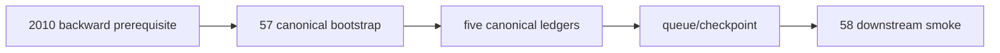

# malf canonical official 2010 bootstrap and replay 结论
`结论编号`：`57`
`日期`：`2026-04-14`
`状态`：`已完成`

## 裁决

- 接受：`H:\Lifespan-data\malf\malf.duckdb` 已完成 `2010` canonical bootstrap，正式生成五个核心账本以及 `work_queue / checkpoint`。
- 接受：`2010` 同窗 replay 为严格 no-op，说明 canonical queue/checkpoint 在真实正式库中已经成立。
- 接受：当前待施工卡前移到 `58-structure-filter-alpha-official-2010-canonical-smoke-card-20260414.md`。
- 拒绝：把 `57` 解释为“无需 data 前置即可直接跑通”，因为本次执行前必须先补齐 `market_base(backward)` 的 `2010` 窗口。

## 原因

1. `57` 的正式主目标已经全部落地。
   - canonical run / queue / checkpoint 三张控制表已建立
   - `pivot / wave / extreme / state / stats` 五个核心账本已真实写入正式库
2. 真实 replay 行为与文档合同一致。
   - 首跑 `claimed_scope_count=5,499`
   - 第二次同窗运行 `claimed_scope_count=0`、`queue_enqueued_count=0`
3. 数据前置缺口已经被识别并补齐。
   - 执行前，`market_base(backward)` 的 `2010` 窗口为空
   - 执行中，先通过正式 `run_market_base_build.py` 补齐 `2010 backward`
   - 补齐后才得以完成 canonical 真正落地

## 影响

1. 当前最新生效结论锚点推进到 `57-malf-canonical-official-2010-bootstrap-and-replay-conclusion-20260414.md`。
2. 当前待施工卡前移到 `58-structure-filter-alpha-official-2010-canonical-smoke-card-20260414.md`。
3. 真实正式主线已从“只有 bridge-v1 的 `malf` 库”前进到“canonical `malf` 已在 `2010` 窗口可落地、可续跑、可 replay”的状态。
4. 后续 `58` 必须继续验证 downstream 默认来源是否真正绑到 canonical。

## 六条历史账本约束检查

| 项目 | 当前状态 | 说明 |
| --- | --- | --- |
| 实体锚点 | 已满足 | canonical 仍以 `asset_type + code + timeframe` 为主锚。 |
| 业务自然键 | 已满足 | 五账本与 checkpoint / queue 均沿用正式自然键，不以 `run_id` 充当主语义。 |
| 批量建仓 | 已满足 | 本卡完成了 `2010-01-01 ~ 2010-12-31` 的 bounded bootstrap。 |
| 增量更新 | 已满足 | source window 与 checkpoint 比对能够压缩后续重复执行。 |
| 断点续跑 | 已满足 | `malf_canonical_work_queue + malf_canonical_checkpoint + replay` 已在真实库验证。 |
| 审计账本 | 已满足 | `malf_canonical_run` 与 execution evidence / record / conclusion 形成完整闭环。 |

## 结论结构图

