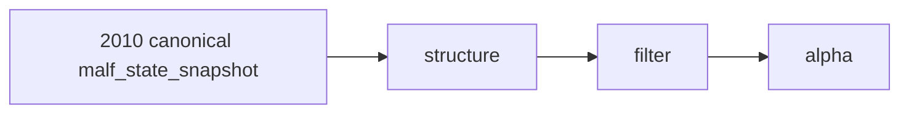

# structure filter alpha official 2010 canonical smoke 卡
`卡号`：`58`
`日期`：`2026-04-14`
`状态`：`已完成`

## 需求

- 问题：真实正式 `structure / filter / alpha` 库中的既有 run summary 仍显示 bridge-v1 输入。
- 目标结果：在 `2010` 窗口上重跑 downstream，确认默认主线已从 canonical `malf_state_snapshot` 读入。
- 为什么现在做：如果 downstream 仍回退到 bridge-v1，`57` 的 canonical 落地就不能算主线贯通。

## 设计输入

- 设计文档：`docs/01-design/modules/system/17-official-middle-ledger-phased-bootstrap-and-real-data-pilot-charter-20260414.md`
- 设计文档：`docs/01-design/modules/malf/08-structure-filter-alpha-rebind-to-canonical-malf-charter-20260411.md`
- 规格文档：`docs/02-spec/modules/system/17-official-middle-ledger-phased-bootstrap-and-real-data-pilot-spec-20260414.md`
- 规格文档：`docs/02-spec/modules/malf/08-structure-filter-alpha-rebind-to-canonical-malf-spec-20260411.md`

## 任务分解

1. 在真实正式库上对 `2010` 窗口重跑 `structure`。
2. 在真实正式库上对 `2010` 窗口重跑 `filter` 与 `alpha`。
3. 检查 run summary 与落表事实，确认默认输入不再回读 bridge-v1。

## 实现边界

- 范围内：`structure / filter / alpha` 的 `2010` canonical smoke、run summary、source table 与 row-count 核对。
- 范围外：`position / portfolio_plan` 批量重建，以及 `trade / system` 恢复。

## 历史账本约束

- 实体锚点：`asset_type + code + timeframe='D'`。
- 业务自然键：沿用 `structure_snapshot / filter_snapshot / alpha_*_event` 的正式自然键。
- 批量建仓：本卡仅执行 `2010` 窗口 bounded build，不扩展到其他年份。
- 增量更新：后续三年窗口与 `2026 YTD` 由 `60-65` 接续，本卡只验证 `2010` 切换效果。
- 断点续跑：默认沿用各模块既有 checkpoint / queue 合同，不允许用临时脚本绕过正式续跑语义。
- 审计账本：`structure_run / filter_run / alpha_*_run` 与 execution evidence / record / conclusion 共同审计。

## 收口标准

1. `structure` 默认来源是 `malf_state_snapshot`。
2. `filter` 默认来源是 `malf_state_snapshot`。
3. `alpha` 默认不再回读 `pas_context_snapshot`。
4. `2010` 窗口下游 summary 与落表事实已留证据。

## 卡片结构图

