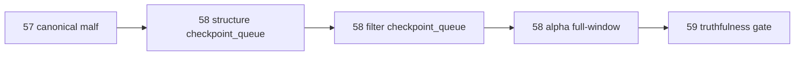

# structure filter alpha official 2010 canonical smoke 结论
`结论编号`：`58`
`日期`：`2026-04-14`
`状态`：`已完成`

## 裁决

- 接受：`structure / filter / alpha` 已在真实正式库完成 `2010` 全窗口 canonical rebind，不再默认回读 bridge-v1。
- 接受：`58` 的正式可行路径是 `structure/filter` 走 `checkpoint_queue`，`alpha` 走 bounded 全窗口；bounded 全量脚本不是本卡的正式主路径。
- 接受：当前待施工卡前移到 `59-mainline-middle-ledger-2010-truthfulness-gate-card-20260414.md`。
- 拒绝：把 `58` 解释为“所有 downstream 都必须一次 bounded 全量重跑才算正式贯通”，因为真实正式 runner 的主语义本来就是 queue/checkpoint/replay。

## 原因

1. 默认正式来源已经在真实 run summary 中切换完成。
   - `structure_run` 最新来源为 `malf_state_snapshot`
   - `filter_run` 最新来源为 `malf_state_snapshot + structure_snapshot`
   - `alpha_formal_signal_run` 最新来源为 `alpha_trigger_event + alpha_family_event + filter_snapshot`，没有再回退 `pas_context_snapshot`
2. 全窗口落表已经在真实正式库形成事实。
   - `structure_snapshot(2010)` 达到 `125,516` 行
   - `filter_snapshot(2010)` 达到 `6,833` 行
   - `alpha_trigger_candidate / trigger_event / family_event / formal_signal_event(2010)` 各达到 `35` 行
3. bounded full-window 的失败不是业务阻塞，而是执行路径选错。
   - `card58-structure-2010-002-full` 超时后被终止
   - 改走 `checkpoint_queue` 后，`structure/filter` 都完成了 `1,833` 个 scope 的正式续跑
4. alpha 全链已经在 canonical 主线上产出真实正式信号。
   - detector 产出 `35` 条 candidate
   - formal signal 最终 `admitted=22`、`blocked=13`

## 影响

1. 当前最新生效结论锚点推进到 `58-structure-filter-alpha-official-2010-canonical-smoke-conclusion-20260414.md`。
2. 当前待施工卡前移到 `59-mainline-middle-ledger-2010-truthfulness-gate-card-20260414.md`。
3. 真实正式主线已经从“只有 canonical `malf`”推进到“`malf -> structure -> filter -> alpha` 在 `2010` 窗口可真实落地并形成正式信号”。
4. `59` 需要回答的重点不再是“是否能跑”，而是“当前这条真实 `2010` 主线是否足以作为后续三年建库模板”。

## 六条历史账本约束检查

| 项目 | 当前状态 | 说明 |
| --- | --- | --- |
| 实体锚点 | 已满足 | downstream 继续沿用 `asset_type + code + timeframe='D'` 与正式 signal/event NK。 |
| 业务自然键 | 已满足 | `structure / filter / alpha_*` 全部使用正式 snapshot/event 自然键，不依赖 `run_id`。 |
| 批量建仓 | 已满足 | `2010` 窗口已在真实正式库中形成完整 downstream 落表。 |
| 增量更新 | 已满足 | `structure/filter` 已通过 checkpoint_queue 证明后续窗口应沿正式续跑路径推进。 |
| 断点续跑 | 已满足 | `structure/filter` 的 queue/checkpoint 已真实落表并消费完成。 |
| 审计账本 | 已满足 | run summary、temp summary 文件与 execution evidence / record / conclusion 已形成闭环。 |

## 结论结构图

