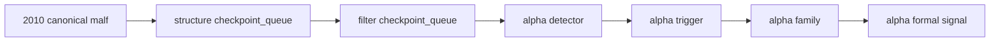

# structure filter alpha official 2010 canonical smoke 证据
`证据编号`：`58`
`日期`：`2026-04-14`

## 实现与验证命令

1. `python scripts/structure/run_structure_snapshot_build.py --signal-start-date 2010-01-01 --signal-end-date 2010-12-31 --limit 5000 --batch-size 500 --run-id card58-structure-2010-001 --summary-path H:\Lifespan-temp\reports\card58-structure-2010-summary.json`
   - 结果：通过
   - 说明：bounded smoke 首次验证 `structure` 默认来源已经改到 `malf_state_snapshot`。
2. `python scripts/filter/run_filter_snapshot_build.py --signal-start-date 2010-01-01 --signal-end-date 2010-12-31 --limit 5000 --batch-size 500 --run-id card58-filter-2010-001 --summary-path H:\Lifespan-temp\reports\card58-filter-2010-summary.json`
   - 结果：通过
   - 说明：bounded smoke 首次验证 `filter` 默认来源已经改到 `malf_state_snapshot + structure_snapshot`。
3. `python scripts/structure/run_structure_snapshot_build.py --limit 500000 --batch-size 500 --run-id card58-structure-2010-003-queue --summary-path H:\Lifespan-temp\reports\card58-structure-2010-queue-summary.json`
   - 结果：通过
   - 说明：改走正式 `checkpoint_queue` 路径，真实消费 `2010` canonical checkpoint 全 scope，`bounded_instrument_count=1833`、`checkpoint_upserted_count=1833`。
4. `python scripts/filter/run_filter_snapshot_build.py --limit 500000 --batch-size 500 --run-id card58-filter-2010-002-queue --summary-path H:\Lifespan-temp\reports\card58-filter-2010-queue-summary.json`
   - 结果：通过
   - 说明：改走正式 `checkpoint_queue` 路径，真实消费 `2010` structure checkpoint 全 scope，`bounded_instrument_count=1833`、`checkpoint_upserted_count=1833`。
5. `python scripts/alpha/run_alpha_pas_five_trigger_build.py --signal-start-date 2010-01-01 --signal-end-date 2010-12-31 --limit 500000 --run-id card58-alpha-detector-2010-002-full --summary-path H:\Lifespan-temp\reports\card58-alpha-detector-2010-full-summary.json`
   - 结果：通过
   - 说明：真实 `2010` 全窗口 detector 共评估 `6,833` 条 `filter_snapshot`，产出 `35` 条 `alpha_trigger_candidate`。
6. `python scripts/alpha/run_alpha_trigger_ledger_build.py --signal-start-date 2010-01-01 --signal-end-date 2010-12-31 --limit 500000 --batch-size 500 --run-id card58-alpha-trigger-2010-002-full --summary-path H:\Lifespan-temp\reports\card58-alpha-trigger-2010-full-summary.json`
   - 结果：通过
   - 说明：`35` 条 detector candidate 全部物化为正式 `alpha_trigger_event`。
7. `python scripts/alpha/run_alpha_family_build.py --signal-start-date 2010-01-01 --signal-end-date 2010-12-31 --limit 500000 --batch-size 500 --run-id card58-alpha-family-2010-002-full --summary-path H:\Lifespan-temp\reports\card58-alpha-family-2010-full-summary.json`
   - 结果：通过
   - 说明：`35` 条 trigger 全部物化为正式 `alpha_family_event`，家族分布为 `bof=7 / tst=17 / pb=6 / cpb=5 / bpb=0`。
8. `python scripts/alpha/run_alpha_formal_signal_build.py --signal-start-date 2010-01-01 --signal-end-date 2010-12-31 --limit 500000 --batch-size 500 --run-id card58-alpha-formal-2010-002-full --summary-path H:\Lifespan-temp\reports\card58-alpha-formal-2010-full-summary.json`
   - 结果：通过
   - 说明：`35` 条 trigger 最终生成 `35` 条正式 `alpha_formal_signal_event`，其中 `admitted=22`、`blocked=13`。

## 落表事实

1. `structure_run` 最新正式 run：`card58-structure-2010-003-queue`，`source_context_table='malf_state_snapshot'`，`source_structure_input_table='malf_state_snapshot'`。
2. `filter_run` 最新正式 run：`card58-filter-2010-002-queue`，`source_context_table='malf_state_snapshot'`，`source_structure_table='structure_snapshot'`。
3. `alpha_trigger_run` 最新正式 run：`card58-alpha-trigger-2010-002-full`，来源为 `alpha_trigger_candidate + filter_snapshot + structure_snapshot`。
4. `alpha_family_run` 最新正式 run：`card58-alpha-family-2010-002-full`，来源为 `alpha_trigger_event + alpha_trigger_candidate`。
5. `alpha_formal_signal_run` 最新正式 run：`card58-alpha-formal-2010-002-full`，来源为 `alpha_trigger_event + alpha_family_event + filter_snapshot`，没有 `fallback_context_table='pas_context_snapshot'`。

## 规模摘要

1. `structure_snapshot` 在 `2010` 窗口已达到 `125,516` 行，覆盖 `1,833` 个标的，时间范围 `2010-01-04 ~ 2010-12-31`。
2. `filter_snapshot` 在 `2010` 窗口已达到 `6,833` 行，覆盖 `1,833` 个标的，时间范围 `2010-01-04 ~ 2010-12-31`。
3. `alpha_trigger_candidate / alpha_trigger_event / alpha_family_event / alpha_formal_signal_event` 在 `2010` 窗口各为 `35` 行，时间范围 `2010-04-27 ~ 2010-12-31`。

## 证据结构图

