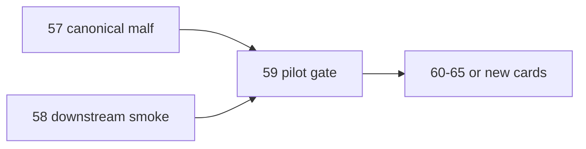

# mainline middle-ledger 2010 truthfulness gate 卡
`卡号`：`59`
`日期`：`2026-04-14`
`状态`：`待施工`

## 需求

- 问题：即使 `57 / 58` 写库成功，也仍需要一个正式 gate 来裁决 `2010` pilot 是否足以作为后续三年建库模板。
- 目标结果：对 `2010` pilot 做 bounded truthfulness / readout / acceptance 复核，并决定是否进入 `60-65`。
- 为什么现在做：三年一段建库不能建立在未裁决的 pilot 之上。

## 设计输入

- 设计文档：`docs/01-design/modules/system/17-official-middle-ledger-phased-bootstrap-and-real-data-pilot-charter-20260414.md`
- 设计文档：`docs/01-design/modules/system/10-mainline-real-data-smoke-regression-charter-20260411.md`
- 规格文档：`docs/02-spec/modules/system/17-official-middle-ledger-phased-bootstrap-and-real-data-pilot-spec-20260414.md`
- 规格文档：`docs/02-spec/modules/system/10-mainline-real-data-smoke-regression-spec-20260411.md`

## 任务分解

1. 汇总 `2010` pilot 的 canonical/downstream 正式 row-count 与 scope-count。
2. 选取代表性样本做 truthfulness / readout spot-check。
3. 对 `60-65` 是否放行给出正式裁决。

## 实现边界

- 范围内：`2010` bounded truthfulness / readout gate，以及 `position / portfolio_plan` 的只读 acceptance 抽查。
- 范围外：三年窗口建库与 `trade / system` 恢复。

## 历史账本约束

- 实体锚点：沿用 `malf -> alpha` 的正式实体锚点。
- 业务自然键：沿用 canonical / snapshot / event / readout 的正式自然键。
- 批量建仓：本卡不新建账本，只复核 `2010` 已完成窗口。
- 增量更新：本卡不推进新窗口，只沉淀 `2010` pilot 审核结论。
- 断点续跑：按上游既有 queue/checkpoint 做只读验收，不新增旁路执行口径。
- 审计账本：正式 run summary、抽样报告、evidence / record / conclusion 共同构成审计闭环。

## 收口标准

1. `2010` pilot 的正式读数与落表事实完成审计。
2. 代表性样本抽查通过或明确挂账。
3. 明确写出是否放行 `60-65`。
4. 若不放行，必须把阻断点写成后续新增卡候选。

## 卡片结构图

