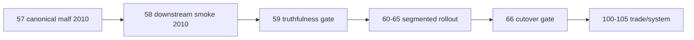

# mainline middle-ledger 2010 truthfulness gate 结论
`结论编号`：`59`
`日期`：`2026-04-14`
`状态`：`已完成`

## 裁决

- 接受：`2010` pilot truthfulness gate 通过，允许按同一正式模板在整改后推进 `80 -> 85`。
- 接受：`78-84` 的唯一正式模板锁定为 `57/58/59` 已验证路径经整改收紧后的版本，即 `malf canonical bootstrap + replay`、`structure/filter bounded full-window（历史建库）+ checkpoint_queue（增量续跑）`、`alpha bounded full-window`。
- 接受：当前待施工卡前移到 `60-mainline-rectification-batch-registration-and-scope-freeze-card-20260415.md`。
- 拒绝：把 `59` 解读为 middle-ledger 的 completeness gate；`59` 只证明 truthfulness，不证明 `2010` 全年 `structure/filter` admission 覆盖已经完整。
- 拒绝：把 `59` 解读为 `position / portfolio_plan / trade / system` 的 `2010` 官方落表已完成；`59` 只证明 middle-ledger 分段建库模板成立，但 `91-95` 仍需先经过 `60-66` 整改闸门，`100-105` 仍要等 `95`。

## 原因

1. `2010` pilot 的真实正式库表事实已经完整闭环。
   - `malf_state_snapshot(D)` 为 `392,478` 行、`1,833` 标的；
   - `structure_snapshot` 为 `125,516` 行；
   - `filter_snapshot` 为 `6,833` 行；
   - `alpha_trigger_event / alpha_family_event / alpha_formal_signal_event` 各为 `35` 行，其中 `admitted=22 / blocked=13`。
2. 正式链路的自然键引用完整性达到 `100%`。
   - `formal signal -> trigger -> filter -> structure -> malf` 全链路无缺口；
   - `structure / filter` 的全部 `source_context_nk` 都能回到 `malf_state_snapshot`；
   - 不存在“表落了，但引用链断了”的 truthfulness 假阳性。
3. 模板路径已经被真实执行事实验证，而不是只被代码设计验证。
   - `57` 的 replay 为严格 no-op，说明 `malf` checkpoint 成立；
   - `58` 的 `structure / filter` 在 `1,833` scope 上完成 queue/checkpoint 正式续跑；
   - `58` 同时暴露出 `structure/filter` 的历史建库不能默认依赖 checkpoint_queue；历史窗口必须走 bounded full-window，checkpoint_queue 只保留为增量续跑路径。
4. middle-ledger 对执行侧的只读消费前提已经成立。
   - `22` 个 admitted signal 全部能在 `market_base(stock_daily_adjusted, adjust_method='none')` 找到正式参考价；
   - 这足以证明 `2010` pilot 之后的 `91-95` 不会因为执行价口径缺失而天然失真。
5. 未完成事项已被正确降级为非阻断项。
   - `position / portfolio_plan` 正式库当前仍只有 `2026-04-09` 的 bounded pilot 样本；
   - 这要求 `59` 只能把它们作为只读 acceptance 抽查，而不能把它们写成 `2010` official truth；
   - 但这不阻断 `91-95`，因为 `56-59` 与 `91-95` 的边界本来就只覆盖 middle-ledger。

## 影响

1. 当前最新生效结论锚点推进到 `59-mainline-middle-ledger-2010-truthfulness-gate-conclusion-20260414.md`。
2. 当前待施工卡前移到 `60-mainline-rectification-batch-registration-and-scope-freeze-card-20260415.md`。
3. `78-84` 必须逐窗复用 `59` 的判据输出，并继承整改后的 downstream 建库口径：
   - 正式 row-count / scope-count
   - queue/checkpoint 稳定性
   - 全链路自然键 truthfulness
   - `structure/filter` 历史窗口 bounded full-window 完整覆盖
   - `market_base(none)` 只读 acceptance
4. `95` 之前仍不得恢复 `100-105`。

## 六条历史账本约束检查
| 项目 | 当前状态 | 说明 |
| --- | --- | --- |
| 实体锚点 | 已满足 | `asset_type + code + timeframe` 与 downstream `instrument / signal_nk` 继续作为正式主语义，未被 `run_id` 替代。 |
| 业务自然键 | 已满足 | `snapshot_nk / event_nk / signal_nk` 全链路可回溯，且在 `2010` pilot 上完成 `100%` 引用匹配。 |
| 批量建仓 | 已满足 | `57/58` 已在真实正式库完成 `2010` bounded bootstrap，并证明可作为后续窗口模板。 |
| 增量更新 | 已满足 | `91-95` 已被裁定必须沿 `checkpoint_queue + replay` 路径推进，而不是回退到一次性全量默认路径。 |
| 断点续跑 | 已满足 | `57` replay no-op、`58` queue/checkpoint 真值成立，说明模板具备正式 resume 语义。 |
| 审计账本 | 已满足 | `run summary + gate report + evidence / record / conclusion` 已形成可追溯审计闭环。 |

## 结论结构图

