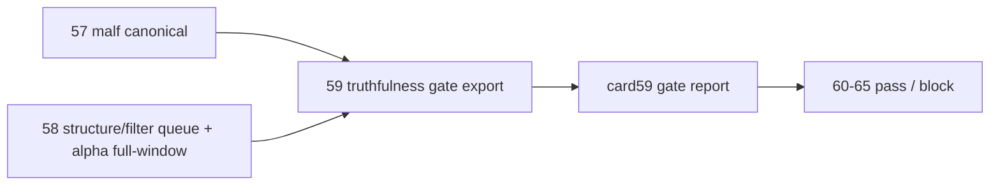

# mainline middle-ledger 2010 truthfulness gate 证据
`证据编号`：`59`
`日期`：`2026-04-14`

## 实现与验证命令
1. `python scripts/system/check_doc_first_gating_governance.py`
   - 结果：通过
   - 说明：当前待施工卡已前移为 `60-mainline-middle-ledger-2011-2013-bootstrap-card-20260414.md`，gating 输出确认其 requirement / design / spec / task breakdown 与历史账本约束齐备，说明 `59` 收口后索引状态一致。
2. 单进程 DuckDB truthfulness gate 导出脚本
   - 结果：通过
   - 导出物：`H:\Lifespan-report\system\card59\mainline-middle-ledger-2010-truthfulness-gate-report-20260414.json`
   - 说明：顺序读取 `malf / structure / filter / alpha / market_base` 正式库，导出 row-count、run summary、链路完整性、代表样本与只读 acceptance 检查，避免 Windows 上并行附库导致的文件锁冲突。
3. `python .codex/skills/lifespan-execution-discipline/scripts/check_execution_indexes.py --include-untracked`
   - 结果：通过
   - 说明：`conclusion / evidence / card / records / reading-order / completion-ledger` 全部与当前施工卡一致。
4. `python scripts/system/check_development_governance.py`
   - 结果：未全仓通过，但无新增文档治理问题
   - 说明：当前仍只报两处既有 file-length 历史债务：`src/mlq/data/data_mainline_incremental_sync.py (1013 行)` 与 `src/mlq/portfolio_plan/runner.py (1705 行)`；`repo-hygiene / entry-freshness / doc-first-gating` 均通过，本卡未新增治理违规。

## 正式导出摘要
报告路径：`H:\Lifespan-report\system\card59\mainline-middle-ledger-2010-truthfulness-gate-report-20260414.json`

1. `malf_state_snapshot(timeframe='D')` 在 `2010` 正式窗口落表 `392,478` 行，覆盖 `1,833` 个标的，范围 `2010-01-04 ~ 2010-12-31`。
2. `structure_snapshot(2010)` 落表 `125,516` 行；`filter_snapshot(2010)` 落表 `6,833` 行；两者均覆盖 `1,833` 个标的，时间范围同为 `2010-01-04 ~ 2010-12-31`。
3. `alpha_trigger_event / alpha_family_event / alpha_formal_signal_event(2010)` 各为 `35` 行，其中 `formal_signal` 为 `admitted=22 / blocked=13`，时间范围 `2010-04-27 ~ 2010-12-31`。
4. `market_base.stock_daily_adjusted(adjust_method='none')` 的 `2010` 窗口同样完整落表 `392,478` 行、`1,833` 个标的，证明 downstream admitted signal 可回到正式执行价口径做只读 acceptance 抽查。

## 链路完整性摘要
1. `alpha_formal_signal_event -> alpha_trigger_event`：`35 / 35` 全部匹配。
2. `alpha_formal_signal_event -> alpha_family_event`：`35 / 35` 全部匹配。
3. `alpha_trigger_event -> filter_snapshot / structure_snapshot`：`35 / 35` 全部匹配。
4. `alpha_formal_signal_event.daily_source_context_nk -> malf_state_snapshot`：`35 / 35` 全部匹配。
5. `structure_snapshot.source_context_nk -> malf_state_snapshot`：`125,516 / 125,516` 全部匹配。
6. `filter_snapshot.source_context_nk -> malf_state_snapshot`：`6,833 / 6,833` 全部匹配。

## 模板约束摘要
1. `57` 已证明 `malf canonical` 在正式库具备 `bootstrap + replay(no-op)` 能力；`5,499` 个 `D/W/M` scope 全部完成，replay `queue_enqueued_count=0`。
2. `58` 已证明 `structure / filter` 的正式模板必须走 `checkpoint_queue`，并各自消费 `1,833` 个 scope；`structure` 的 bounded full-window 只保留为失败审计事实，不再作为 `60-65` 默认模板。
3. `58` 已证明 `alpha` 在 `2010` 窗口可沿 `filter_snapshot + structure_snapshot` 走 bounded full-window 产出正式 `trigger / family / formal signal`，且 `formal signal` 未回退 `pas_context_snapshot`。

## 只读 acceptance 摘要
1. `22` 个 admitted `alpha_formal_signal_event` 全部能在 `market_base(stock_daily_adjusted, adjust_method='none')` 找到 `signal_date` 当日或之后的首个正式价格，覆盖率 `22 / 22`。
2. `position / portfolio_plan` 正式库当前仍只保留 `2026-04-09` 的 bounded pilot 样本，不存在 `2010` 官方 materialization；因此 `59` 只把它们作为只读契约兼容性抽查，不把它们误记为 `2010` 真值事实。

## 代表样本
1. `002075.SZ @ 2010-04-27 / tst / admitted`
   - `trigger -> filter -> structure -> malf` 引用完整，`filter.trigger_admissible=true`，并能在 `market_base(none)` 找到当日正式收盘价 `6.25`。
2. `600313.SH @ 2010-04-29 / bof / blocked`
   - `trigger -> filter -> structure -> malf` 引用完整，`primary_blocking_condition='structure_progress_failed'`，符合 blocked 真值。
3. `000903.SZ @ 2010-12-07 / pb / admitted`
   - `structure_progress_state='advancing'`，且能在 `market_base(none)` 找到当日正式收盘价 `17.60`。
4. `002033.SZ @ 2010-12-31 / cpb / admitted`
   - 证明 `cpb` 家族也能沿同一正式链路落到 admitted signal，并在 `market_base(none)` 找到正式收盘价 `34.50`。

## 证据结构图

