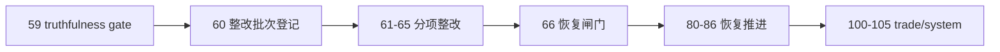

# mainline rectification batch registration and scope freeze card

`卡号：60`
`日期：2026-04-15`
`状态：已完成`

## 需求

- 问题：`59` 已证明 `2010` 真实正式库上的 canonical middle-ledger 主线可跑通，但未证明 `structure -> filter -> alpha` 已具备全年完整覆盖与职责边界闭环；在本次重排前，执行索引仍把原分段建库卡组视为直接续接主线，已不符合最新整改判断。
- 目标结果：先把主线整改问题正式登记为 `60-66` 卡组，冻结范围、前移当前施工位，并明确原分段建库 `80-86` 进入挂起等待恢复状态。
- 为什么现在做：如果不先改施工位与索引口径，后续原分段建库卡组 `80-86` 会继续在错误前提下被当成默认续推主线，导致整改问题无法被正式记录、审计和收口。

## 设计输入

- `docs/01-design/00-system-charter-20260409.md`
- `docs/02-spec/Ω-system-delivery-roadmap-20260409.md`
- `docs/03-execution/59-mainline-middle-ledger-2010-truthfulness-gate-conclusion-20260414.md`
- `docs/03-execution/B-card-catalog-20260409.md`
- `docs/03-execution/C-system-completion-ledger-20260409.md`

## 任务分解

1. 把主线整改问题拆成 `60 -> 61 -> 62 -> 63 -> 64 -> 65 -> 66` 七张正式执行卡。
2. 回填 `README / AGENTS / Ω / 00 / A / B / C`，把当前待施工卡切到 `60`，并把原分段建库 `80-86` 标记为挂起等待整改收口后恢复。
3. 冻结整改批次与后续恢复顺序：`60-66 -> 80-86 -> 100-105`。

## 实现边界

- 本卡只负责整改批次登记、执行位迁移与索引口径收紧。
- 本卡不直接修改 `structure / filter / alpha / wave_life` 正式实现。
- 本卡不裁决 `80-86` 是否废弃，只裁决其当前不再作为 active 卡组。

## 历史账本约束

- 实体锚点：执行卡 `card_no`
- 业务自然键：`card_no + slug`
- 批量建仓：一次性登记 `60-66` 卡组并回填执行索引
- 增量更新：后续每张整改卡接受后按顺序推进当前施工位
- 断点续跑：通过 `B-card-catalog / C-system-completion-ledger / Ω roadmap` 维护当前 active 卡位
- 审计账本：`README / AGENTS / 00 / A / B / C / Ω` 与 `90-* evidence / record / conclusion`

## 收口标准

1. `60-66` 已全部注册到执行目录。
2. 当前待施工卡与当前下一锚已切到 `60`。
3. `80-86` 已在正式索引中明确标成整改后恢复卡组。
4. `100-105` 仍保持在 `66` 之后，不允许越级恢复。

## 卡片结构图

