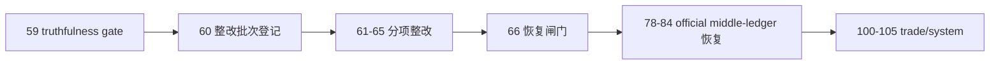

# mainline rectification batch registration and scope freeze 结论
`结论编号`：`60`
`日期`：`2026-04-15`
`状态`：`已完成`

## 裁决

- 接受：`60 -> 66` 被正式登记为 `59` 之后、`78 -> 84` 之前的主线整改卡组。
- 接受：`78 -> 84` 被正式保留为整改后的 official middle-ledger 恢复卡组，不再作为当前默认续推卡组。
- 接受：`100 -> 105` 继续保持冻结，只有 `95` 接受后才允许恢复。
- 接受：当前待施工卡从 `60` 前移到 `61-structure-filter-tail-coverage-truthfulness-rectification-card-20260415.md`。
- 拒绝：在未登记整改批次的前提下，直接把 `59` 当作 `78-84` 或 `100-105` 的默认放行依据。

## 原因

1. `59` 只裁决了 `2010` pilot 的 truthfulness gate，并没有把整改问题本身登记为正式主线卡组。
2. 如果不先修正执行索引，后续会继续把 `78-84` 误当成默认 active 卡组，导致整改问题失去正式审计入口。
3. `trade / system` 的恢复前提仍然是：
   - `60 -> 66` 整改收口
   - `78 -> 84` official middle-ledger 恢复与 cutover gate 通过

## 影响

1. 当前正式主线顺序冻结为 `60 -> 61 -> 62 -> 63 -> 64 -> 65 -> 66 -> 78 -> 79 -> 80 -> 81 -> 82 -> 83 -> 84 -> 100 -> 101 -> 102 -> 103 -> 104 -> 105`。
2. 入口文件、路线图和执行索引必须全部服从该顺序。
3. `61 -> 65` 成为后续真正处理 completeness、filter 边界、wave_life 接入和 formal signal 分权的正式施工位。

## 六条历史账本约束检查

| 项目 | 当前状态 | 说明 |
| --- | --- | --- |
| 实体锚点 | 已满足 | 执行卡实体继续以 `card_no` 为锚点 |
| 业务自然键 | 已满足 | `card_no + slug` 仍是执行索引自然键 |
| 批量建仓 | 已满足 | `60-66` 已一次性注册为整改批次 |
| 增量更新 | 已满足 | 每接受一张整改卡后按自然数推进当前施工位 |
| 断点续跑 | 已满足 | `00 / A / B / C / Ω` 共同承担当前施工位与恢复顺序续跑语义 |
| 审计账本 | 已满足 | `card / evidence / record / conclusion` 已构成正式登记闭环 |

## 结论结构图

