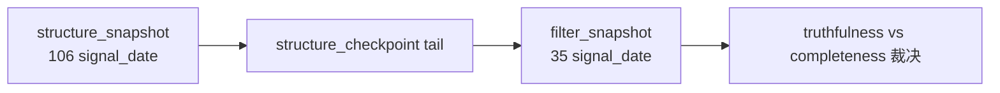

# structure filter tail coverage truthfulness rectification card

`卡号：61`
`日期：2026-04-15`
`状态：已完成`

## 需求

- `2010` 正式库中 `structure_snapshot=125,516` 行、覆盖 `106` 个 `signal_date`，而 `filter_snapshot=6,833` 行、只覆盖 `35` 个 `signal_date`。
- 该差距并非由 `filter` 两条硬拦截规则直接造成，而是与 `structure_checkpoint -> filter tail window` 的稀疏覆盖绑定。
- 需要冻结 `tail-driven truthfulness` 与 `full-history completeness` 的正式边界，并裁决是否补齐 `structure/filter` 的全历史 admission 覆盖路径。

## 设计输入

- `docs/02-spec/Ω-system-delivery-roadmap-20260409.md`
- `docs/03-execution/11-structure-filter-formal-contract-and-minimal-snapshot-conclusion-20260409.md`
- `docs/03-execution/28-system-wide-checkpoint-and-dirty-queue-alignment-conclusion-20260411.md`
- `docs/03-execution/59-mainline-middle-ledger-2010-truthfulness-gate-conclusion-20260414.md`

## 任务分解

1. 固化 `2010` `structure -> filter` 覆盖差异、日期分布与 checkpoint/tail 机制事实。
2. 裁决当前 `structure_checkpoint / filter_checkpoint` 稀疏 tail 覆盖是正式预期、过渡态，还是需要新增 full-history bootstrap/rematerialize 入口。
3. 回填 `61` 的 evidence / record / conclusion，并把 `59` 相关口径收紧为 truthfulness 不等于 completeness。

## 实现边界

- 本卡只处理 `structure / filter` 正式账本覆盖与 checkpoint 语义。
- 本卡不直接改写 `alpha / position / trade`。
- 若需 runner/schema 变更，只允许落在 `structure / filter` 正式 bounded 入口与对应账本表族内。

## 历史账本约束

- 实体锚点：`asset_type + code + timeframe='D'`
- 业务自然键：`instrument + signal_date`
- 批量建仓：允许按 `2010` 或指定窗口一次性重放 `structure/filter`
- 增量更新：继续围绕 `structure_checkpoint / filter_checkpoint` 驱动
- 断点续跑：不得绕开 `tail_start_bar_dt / last_completed_bar_dt / replay` 语义
- 审计账本：`structure_run / filter_run / *_checkpoint / *_run_snapshot` 与 `61-* evidence / record / conclusion`

## 收口标准

1. `2010` `structure/filter` 覆盖差异已有正式定性与证据。
2. `truthfulness` 与 `completeness` 的正式口径已分开写清。
3. 是否需要 full-history coverage 补齐路径已有明确裁决。

## 卡片结构图

