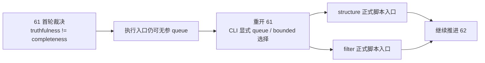

# structure filter tail coverage truthfulness rectification 结论
`结论编号`：`61`
`日期`：`2026-04-15`
`状态`：`已完成`

## 裁决

- 接受：`61` 本轮按“重开后再收口”处理，补齐上一轮遗漏的执行入口缺口。
- 接受：`truthfulness != completeness` 的裁决不再只停留在文档层，已经落到 `structure/filter` 正式脚本入口。
- 接受：`scripts/structure/run_structure_snapshot_build.py` 与 `scripts/filter/run_filter_snapshot_build.py` 现在必须二选一：
  - 显式给出 `signal_start_date / signal_end_date`，执行 bounded full-window
  - 显式给出 `--use-checkpoint-queue`，执行 checkpoint queue
- 接受：无参数且未显式声明 queue 的正式 CLI 调用现在直接报错，不再静默进入 checkpoint queue。
- 接受：runner API 的 queue 语义保持不变；只有正式脚本入口启用 `require_explicit_queue_mode=True`，因此 daily incremental / replay 既有实现不受破坏。
- 接受：`AGENTS.md`、`README.md` 与 `pyproject.toml` 已同步到 `61` 最新生效结论锚点、`62` 当前待施工卡口径，以及 `structure/filter` 正式 CLI 的显式执行模式要求。
- 拒绝：把“文档里已经写明 80-86 必须走 bounded full-window”视为足够，不再需要执行口径防呆。
- 拒绝：为修复 `61` 而提前改写 `62` 的 filter authority / verdict 边界。

## 原因

### 1. `61` 首轮收口只完成了裁决，没有完成执行防呆

上一轮 `61` 已经明确：

1. `59` 的 truthfulness gate 不能被误读为全年 completeness
2. `80-86` 年度历史建库必须走 bounded full-window
3. checkpoint queue 只适合作为增量续跑路径

但正式脚本入口仍然允许无参默认进入 queue，这意味着错误操作路径仍然存在。

### 2. 正确修复点是“正式脚本入口”，不是“重写 queue 引擎”

queue 自身并没有错。错的是把 queue 误当成历史建库主路径。因此本轮只做：

1. 正式 CLI 显式选择执行模式
2. runner 增加入口级防呆能力

而不改：

1. checkpoint 账本语义
2. replay 语义
3. bounded / queue 的底层 materialization 逻辑

### 3. 入口文件同步规则要求 `pyproject.toml` 一并修复

`pyproject.toml` 仍停留在 `59 -> 60` 的旧口径，与：

1. `README.md`
2. `AGENTS.md`
3. `docs/02-spec/Ω-system-delivery-roadmap-20260409.md`
4. `docs/03-execution/00 / B / C`

不一致，属于正式入口文件滞后，必须在本轮一并补齐。

## 影响

1. `61` 的裁决第一次具备可执行约束，而非纯文档约束。
2. 后续 `80-86` 若误用无参 CLI，不会再静默生成 tail-sparse 历史库，而会直接失败暴露问题。
3. `62` 可以继续只聚焦 filter pre-trigger boundary 与 authority reset，不必再承担 `61` 的执行入口善后。
4. 当前最新生效结论锚点保持为 `61-structure-filter-tail-coverage-truthfulness-rectification-conclusion-20260415.md`。
5. 当前待施工卡保持为 `62-filter-pre-trigger-boundary-and-authority-reset-card-20260415.md`。

## 六条历史账本约束检查

| 项目 | 当前状态 | 说明 |
| --- | --- | --- |
| 实体锚点 | 已满足 | `asset_type + code + timeframe='D'` 未改 |
| 业务自然键 | 已满足 | `instrument + signal_date` 未改 |
| 批量建仓 | 已满足 | 历史窗口建库现在必须显式给出 bounded window |
| 增量更新 | 已满足 | queue/checkpoint 仍保留为正式增量续跑路径 |
| 断点续跑 | 已满足 | checkpoint / replay 账本语义未改 |
| 审计账本 | 已满足 | `run / checkpoint / work_queue / summary` 与 `61` evidence / record / conclusion 完整回填 |

## 结论结构图

