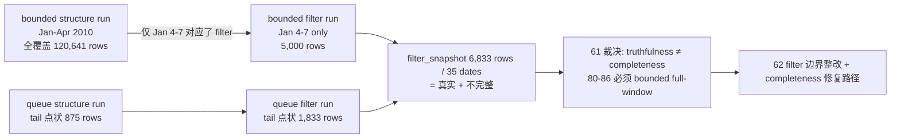

# structure filter tail coverage truthfulness rectification 结论
`结论编号`：`61`
`日期`：`2026-04-15`
`状态`：`已完成`

## 裁决

- **接受**：`truthfulness ≠ completeness` 正式成立为系统级分离原则。
  - Truthfulness：现有数据的引用完整性（100% 回溯到 malf，59 已验证）。
  - Completeness：全历史窗口内所有标的所有日期均被 filter 完成 admission 判定。
- **接受**：2010 正式库当前 `filter_snapshot` 是 **不完整的**（6,833 行 / 35 signal_dates），不代表全年覆盖。
- **接受**：filter 的覆盖缺口根因是 bounded filter run 窗口极窄（仅 Jan 4-7），加上 checkpoint_queue 机制本身不覆盖历史（每 scope 只处理 1 天 tail）。
- **接受**：`80-86` 的每一个年度窗口，structure 和 filter **必须默认走 bounded full-window**（显式指定 `signal_start_date / signal_end_date`），不得仅依靠默认的 checkpoint_queue 模式（no args）完成历史建库。
- **拒绝**：把 59 结论中 "middle-ledger 事实完整闭环" 解读为 "filter 对 2010 全年的 admission 判定已经完成"。59 的 "完整闭环" 只是 truthfulness 维度上的闭环（引用链无断裂），不是 completeness 维度上的闭环。
- **拒绝**：把 checkpoint_queue 模式视为历史建库的主路径。它是增量更新的正确路径，不是全量历史建库的路径。

## 原因

### 1. Structure 覆盖分布严重失衡

2010 全年 structure_snapshot 的 106 个 signal_dates 中：
- 83 个 signal_dates（Jan-Apr）来自 bounded run，行密度 ≈1,490/date（近全 1,833 标的）
- 23 个 signal_dates（Mar-Dec tail）来自 queue run，行密度 ≈1 row/date（单标的 tail 事件）
- "106 signal_dates" 这个数字严重混淆了两种来源的质量差异

### 2. Filter 覆盖缺口达 96%

Filter 的密集段只有 Jan 4-7（4 days × ≈1,250 rows），覆盖 structure 密集段的约 4%（5,000 行 vs 120,641 行）。Feb + Mar + Apr 的约 59 个 signal_dates、约 87,851 行 structure 事实在 filter 层没有任何 admission 判定。

### 3. Checkpoint_queue 的设计语义与历史建库不匹配

- Queue 模式读取 `structure_checkpoint.tail_start_bar_dt -> last_completed_bar_dt`
- 所有 1,833 个标的的 `tail_start == last_completed`（同一点），replay 窗口长度为 0-1 天
- 这是 queue 为增量更新设计的正确行为，但首次历史建库不应依赖它作为主路径

### 4. Bounded full-window 是历史建库的正确主路径

`_run_structure_bounded_build` / `_run_filter_bounded_build` 支持显式 `signal_start_date / signal_end_date`，可以覆盖任意历史窗口内所有标的的全量数据。这是 80-86 的正确工作模式。

## 影响

1. **59 口径收紧**：59 结论中 "middle-ledger 真实正式库表事实完整闭环" 限定为 truthfulness 维度，不再被解释为 completeness。
2. **80-86 建库规范**：每个年度窗口必须先以 bounded full-window 完成 structure，再以 bounded full-window 完成 filter，才算该窗口 completeness 成立。
3. **60 整改批次登记进一步确认**：61 的裁决说明 filter 的 completeness 修复不只是"跑多几轮 queue"，而是需要明确的 bounded 全量重建入口——这将在 62 卡（filter pre-trigger boundary and authority reset）中与职责边界整改一并处理。
4. **当前待施工卡推进到 62**。

## 六条历史账本约束检查

| 项目 | 当前状态 | 说明 |
| --- | --- | --- |
| 实体锚点 | 已满足 | `asset_type + code + timeframe='D'`；filter 以 `instrument + signal_date` 作为业务自然键，引用完整 |
| 业务自然键 | 已满足 | 现有 6,833 行 filter_snapshot 的 NK 均可回溯到 structure_snapshot 和 malf_state_snapshot |
| 批量建仓 | **未满足** | 当前 filter 缺少 2010 全年 bounded full-window 入口；bounded run 仅覆盖 Jan 4-7 |
| 增量更新 | 已满足 | queue/checkpoint 续跑机制已验证（用于每日增量），不适用于历史补全 |
| 断点续跑 | 有条件满足 | queue 续跑对 tail 覆盖有效；历史全量重建依赖 bounded run，需显式触发 |
| 审计账本 | 已满足 | 61 的 evidence / record / conclusion 形成闭环，正式库数据未被破坏性修改 |

## 结论结构图

