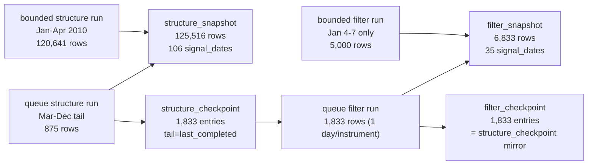

# structure filter tail coverage truthfulness rectification 证据
`证据编号`：`61`
`日期`：`2026-04-15`

## 实现与验证命令

1. 正式库查询脚本 `scripts/system/card61_evidence_query.py`（临时辅助，用后删除）
   - 结果：通过，JSON 报告写入 `H:\Lifespan-report\system\card61\card61-structure-filter-coverage-evidence.json`
   - 说明：顺序读取 `structure.duckdb` 和 `filter.duckdb`，导出覆盖统计、checkpoint tail 分布与 admissibility 细目，不修改任何正式账本。

## structure_snapshot 2010 覆盖摘要

| 指标 | 值 |
| --- | --- |
| 总行数 | 125,516 |
| distinct signal_dates | 106 |
| distinct instruments | 1,833 |
| 日期范围 | 2010-01-04 ~ 2010-12-31 |

### 按月分布（关键事实）

| 月份 | signal_dates | rows | 均值 rows/date |
| --- | --- | --- | --- |
| 2010-01 | 20 | 29,790 | ≈1,490 |
| 2010-02 | 15 | 22,839 | ≈1,523 |
| 2010-03 | 23 | 35,489 | ≈1,543 |
| 2010-04 | 21 | 32,523 | ≈1,549 |
| 2010-05 | 4  | 3,053  | ≈763   |
| 2010-06 | 1  | 1      | 1      |
| 2010-07 | 1  | 1      | 1      |
| 2010-08 | 1  | 1      | 1      |
| 2010-09 | 1  | 1      | 1      |
| 2010-10 | 3  | 3      | 1      |
| 2010-11 | 5  | 6      | ≈1.2   |
| 2010-12 | 11 | 1,809  | ≈164   |

**关键结论**：Jan-Apr 为全覆盖密集段（共 83 个 signal_dates、120,641 行，约全部 1,833 个标的/天），来自 bounded full-window run；May-Nov 几乎为空（每月 1-5 行），来自 checkpoint_queue tail 跑；Dec 为部分恢复（1,809 行）。

## structure_checkpoint 状态摘要

| 指标 | 值 |
| --- | --- |
| checkpoint 总数 | 1,833（= distinct instruments） |
| distinct last_completed_bar_dt | 31 |
| last_completed min/max | 2010-03-19 / 2010-12-31 |
| tail_start min/max | 2010-03-19 / 2010-12-31 |
| tail_confirm min/max | 2010-03-19 / 2010-12-31 |

**关键事实**：对所有 1,833 个标的，`tail_start_bar_dt == last_completed_bar_dt`。这意味着 queue 模式下每个 scope 的 replay 窗口长度为 1 天（从 tail_start 到 last_completed 都是同一日期）。这是 checkpoint_queue 机制在首次建库时的固有特征：它只记录"最后完成到的日期"作为 tail，不保留建库期间跨过的完整历史段。

## filter_snapshot 2010 覆盖摘要

| 指标 | 值 |
| --- | --- |
| 总行数 | 6,833 |
| distinct signal_dates | 35 |
| distinct instruments | 1,833 |
| 日期范围 | 2010-01-04 ~ 2010-12-31 |

### 按月分布

| 月份 | signal_dates | rows | 来源 |
| --- | --- | --- | --- |
| 2010-01 | 4 | 5,000 | **bounded filter run**（Jan 4-7，不写 checkpoint） |
| 2010-03 | 2 | 2 | queue tail |
| 2010-04 | 4 | 7 | queue tail |
| 2010-05 | 2 | 2 | queue tail |
| 2010-06 | 1 | 1 | queue tail |
| 2010-07 | 1 | 1 | queue tail |
| 2010-08 | 1 | 1 | queue tail |
| 2010-09 | 1 | 1 | queue tail |
| 2010-10 | 3 | 3 | queue tail |
| 2010-11 | 5 | 6 | queue tail |
| 2010-12 | 11 | 1,809 | queue tail |

### 1 月 4 天明细

| signal_date | instruments | rows |
| --- | --- | --- |
| 2010-01-04 | 1,477 | 1,477 |
| 2010-01-05 | 1,474 | 1,474 |
| 2010-01-06 | 1,475 | 1,475 |
| 2010-01-07 | 574   | 574   |

### admissibility 分布

| trigger_admissible | count |
| --- | --- |
| false | 2,593 |
| true  | 4,240 |

## filter_checkpoint 状态摘要

| 指标 | 值 |
| --- | --- |
| checkpoint 总数 | 1,833 |
| last_completed min/max | 2010-03-19 / 2010-12-31 |
| tail_start min/max | 2010-03-19 / 2010-12-31 |

**filter_checkpoint 精确镜像 structure_checkpoint**：两者的 last_completed/tail_start 分布完全相同。filter bounded Jan run（产出 5,000 行）未写入 filter_checkpoint；filter checkpoint 只反映 queue 模式产出的 31 个 tail 日期。

## 机制诊断

```
bounded structure run (Jan-Apr)  →  structure_snapshot: 120,641 rows, NO structure_checkpoint
bounded filter run   (Jan 4-7)   →  filter_snapshot:      5,000 rows, NO filter_checkpoint
                                    ↑ 这是 filter 唯一的密集覆盖，且窗口极窄（仅 4 天）

queue structure run (malf checkpoint tail Mar-Dec)
  → structure_snapshot: 875 rows (sparse tail)
  → structure_checkpoint: 1,833 entries (tail=last_completed, 点状覆盖)

queue filter run (structure_checkpoint tail)
  → filter_snapshot:  1,833 rows (each instrument 1 day only)
  → filter_checkpoint: 1,833 entries (mirror of structure_checkpoint)
```

## 证据结构图



## 核心差距量化

| 区段 | structure 覆盖 | filter 覆盖 | 差距 |
| --- | --- | --- | --- |
| Jan 全月 (20 dates) | 29,790 rows | 5,000 rows (4 dates) | **缺 16 dates** |
| Feb 全月 (15 dates) | 22,839 rows | 0 rows | **缺 15 dates** |
| Mar 全月 (23 dates) | 35,489 rows | 2 rows (2 tail) | **实质缺 23 dates** |
| Apr 全月 (21 dates) | 32,523 rows | 7 rows (4 tail) | **实质缺 21 dates** |
| 合计 Jan-Apr dense | 120,641 rows | 5,009 rows | **filter 缺漏约 96%** |
