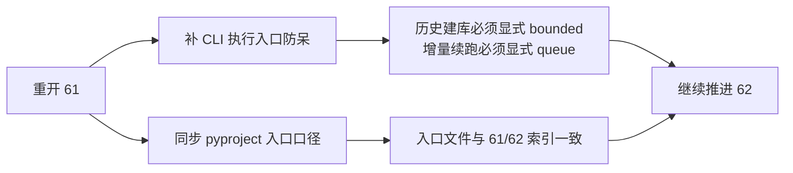

# structure filter tail coverage truthfulness rectification 记录
`记录编号`：`61`
`日期`：`2026-04-15`

## 重开原因

`61` 首轮收口解决了“truthfulness 不等于 completeness”的系统级裁决，但没有把这条裁决落到正式脚本入口：

1. `structure/filter` 的 CLI 仍允许无参默认走 queue
2. 这会让历史窗口建库继续存在“误把增量续跑路径当历史建库路径”的执行风险
3. `pyproject.toml` 仍停留在 `59 -> 60` 的旧锚点，违反入口文件同步规则

因此本轮按“重开 61”处理，不把问题推迟到 `62`，避免 `62` 的 filter 职责整改混入 `61` 的执行入口缺口。

## 本轮执行步骤

1. 复核 `61` 既有 evidence / record / conclusion，确认上一轮确实只完成了裁决和数据分析，未改正式入口代码。
2. 复核 `scripts/structure/run_structure_snapshot_build.py` 与 `scripts/filter/run_filter_snapshot_build.py`，确认两者无参调用均会默认走 queue。
3. 在 `src/mlq/structure/runner.py` 与 `src/mlq/filter/runner.py` 增加“显式 queue 模式”防呆支持，但不改 queue 引擎本体。
4. 在两个正式脚本入口增加 `--use-checkpoint-queue`，并把“无 window 且未显式 queue”改为直接报错。
5. 为 `structure/filter` 补齐显式 queue 模式单测，并为新增测试文件补齐中文说明。
6. 重写 `pyproject.toml`，同步 `61/62` 当前正式口径并清理乱码注释。
7. 同步刷新 `AGENTS.md` 与 `README.md`，把 `structure/filter` 正式 CLI 必须显式声明 bounded window 或 `--use-checkpoint-queue` 的口径写回入口文件。
8. 运行 pytest 与治理检查，确认没有引入新的触达文件超长违规，也没有新增入口联动遗漏。

## 关键实现取舍

### 1. 只收紧正式脚本入口，不重写 queue 语义

本轮没有把 queue 默认语义从 runner API 中删除，原因是：

1. checkpoint queue 仍是 daily incremental / replay 的正式路径
2. 直接改写 API 默认行为会扩大影响面，超出 `61` 的“rectification”边界
3. 本轮真正需要落地的是“正式脚本入口不得再把无参 queue 当历史建库默认路径”

因此采用分层方案：

- runner：保留原语义，只增加 `require_explicit_queue_mode=True` 防呆能力
- script：正式入口默认启用该防呆

### 2. 不在 61 内提前处理 62 的 filter authority 重置

虽然本轮触达了 `filter` runner，但只处理执行模式防呆，不处理：

1. `structure_progress_failed`
2. `reversal_stage_pending`
3. `filter -> alpha` admission authority 边界

这些仍留在 `62`，以免把“coverage / execution-mode”问题和“authority / verdict”问题混写。

## 结果

1. `61` 的系统级裁决已落到正式脚本入口。
2. 历史窗口建库不能再通过“无参默认 queue”静默启动。
3. `AGENTS.md / README.md / pyproject.toml` 已与 `Ω / 00 / B / C` 对齐到 `61/62` 口径，并补齐 `structure/filter` 正式 CLI 的显式执行模式说明。
4. 当前最新生效结论锚点仍为 `61`，当前待施工卡仍为 `62`，无需回退执行索引。

## 残留项

1. 全仓治理盘点仍存在历史 file-length backlog，但与本轮改动无直接关系。
2. `62` 仍是下一张正式施工卡，继续负责 filter pre-trigger boundary 与 authority reset。

## 记录结构图

