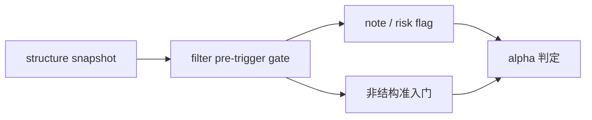

# filter pre-trigger boundary and authority reset card

`卡号：62`
`日期：2026-04-15`
`状态：待施工`

## 需求
- 问题：当前 `filter` 的正式硬拦截包含 `structure_progress_failed` 与 `reversal_stage_pending`，带有结构裁决色彩；这使 `filter` 越过 pre-trigger admission 边界，提前替 `alpha` 给出结构性 hard verdict。
- 目标结果：正式裁决 `filter` 只保留哪些非结构准入门，哪些结构字段必须降为 note/risk flag，并明确 `filter -> alpha formal signal` 的 admission authority 分界。
- 为什么现在做：`61` 已经确认 truthfulness 不等于 completeness；如果不先把 `filter` 的职责边界掰正，后续 `63 -> 65` 会继续把 coverage 修复、wave_life 接入和 formal signal 分权混写在同一层，主线整改无法稳定收口。

## 设计输入

- `docs/01-design/modules/filter/00-filter-module-lessons-20260409.md`
- `docs/01-design/modules/alpha/01-alpha-formal-signal-output-charter-20260409.md`
- `docs/01-design/modules/malf/08-structure-filter-alpha-rebind-to-canonical-malf-charter-20260411.md`
- `docs/03-execution/11-structure-filter-formal-contract-and-minimal-snapshot-conclusion-20260409.md`
- `docs/03-execution/31-structure-filter-alpha-rebind-to-canonical-malf-conclusion-20260411.md`
- `docs/03-execution/59-mainline-middle-ledger-2010-truthfulness-gate-conclusion-20260414.md`
- `docs/03-execution/61-structure-filter-tail-coverage-truthfulness-rectification-conclusion-20260415.md`
- `docs/02-spec/Ω-system-delivery-roadmap-20260409.md`

## 任务分解

1. 列清当前 `filter` 的硬门、软提示、透传字段与下游消费方式。
2. 裁决 `filter` 的正式边界：保留非结构准入、降级结构 verdict，还是维持现状并重新定义职责。
3. 回填 `62` evidence / record / conclusion，并同步 `filter -> alpha formal signal` 的合同表述。

## 实现边界

- 本卡只处理 `filter` 的 pre-trigger 职责边界与合同。
- 本卡不直接扩改 `alpha detector` 逻辑重写。
- 如需新增非结构门控，必须保持 bounded runner、自然键和审计语义不变。

## 历史账本约束

- 实体锚点：`asset_type + code + timeframe='D'`
- 业务自然键：`instrument + signal_date`
- 批量建仓：允许按窗口重物化 `filter_snapshot`
- 增量更新：仍以 `filter_work_queue / filter_checkpoint` 续跑
- 断点续跑：不得把 `run_id` 充当业务主键
- 审计账本：`filter_run / filter_snapshot / filter_run_snapshot` 与 `62-* evidence / record / conclusion`

## 收口标准

1. `filter` 的正式门控边界已有书面裁决。
2. 结构性 hard block 与非结构准入门已分清。
3. 与 `alpha formal signal` 的 admission authority 交界已明确标注。

## 卡片结构图

