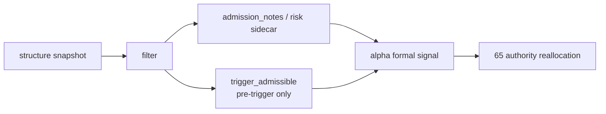

# filter pre-trigger boundary and authority reset 结论
`结论编号`：`62`
`日期`：`2026-04-15`
`状态`：`已完成`

## 裁决

- 接受：`filter` 的正式 hard block 不再包含 `structure_progress_failed` 与 `reversal_stage_pending`。
- 接受：上述结构字段现在只允许以下游 `note / risk flag` 方式沉淀在 `filter_snapshot`，不得再写成 `primary_blocking_condition`。
- 接受：`filter.trigger_admissible` 的正式语义收窄为 pre-trigger gate 是否放行，不再提前替 `alpha formal signal` 给出结构性 blocked verdict。
- 接受：`alpha` 当前仍直接消费 `filter.trigger_admissible` 生成 `formal_signal_status`，该实现事实被显式保留到 `65` 再重分配，不在 `62` 内混改。
- 拒绝：继续把 `filter` 当作结构裁决层，在 `alpha` 前置输出 blocked/admitted 结论。
- 拒绝：在 `62` 内直接改写 `alpha formal signal` 的 authority 分配，抢跑 `65`。

## 原因

### 1. `filter` 的正式职责是 pre-trigger admission，不是结构 verdict

`62` 卡和既有 filter 设计输入已经明确：

1. `structure` 负责结构事实
2. `filter` 负责 pre-trigger gate
3. `alpha` 才是后续正式信号解释层

如果 `filter` 继续把 `structure_progress_failed / reversal_stage_pending` 写成 hard block，就会再次越界替 `alpha` 裁决。

### 2. 结构观察应该沉淀，但不该在 `filter` 层升级为阻断

这些字段仍然重要，所以本轮不是删除，而是降级：

1. 写入 `admission_notes`
2. 保留既有 `break / exhaustion / reversal_probability` sidecar 提示
3. 让下游还能读到结构风险，但不让 `filter` 提前代替 `alpha` 做最终结论

### 3. `65` 已为 authority reallocation 预留正式施工位

当前 `alpha formal signal` 仍直接跟随 `filter.trigger_admissible`。这是一个已登记的后续问题，但它属于 `65`，不是 `62`。本轮先把上游越界问题切掉，后续再把 blocked/admitted 权力正式接回 `alpha`。

## 影响

1. `filter_snapshot` 对结构失败或下行 reversal pending 样本不再落 `primary_blocking_condition`。
2. 同一批样本在当前实现下会继续进入 `alpha`，因此 `alpha_formal_signal_event` 的 admitted/blocked 分布会发生变化。
3. `62` 之后，`filter -> alpha` 的权责边界第一次被明确写成正式事实：
   - `filter` 负责 gate + note/risk
   - `alpha` 负责后续正式 verdict
4. 当前最新生效结论锚点推进到 `62-filter-pre-trigger-boundary-and-authority-reset-conclusion-20260415.md`。
5. 当前待施工卡推进到 `63-wave-life-official-ledger-truthfulness-and-bootstrap-card-20260415.md`。

## 六条历史账本约束检查

| 项目 | 当前状态 | 说明 |
| --- | --- | --- |
| 实体锚点 | 已满足 | `asset_type + code + timeframe='D'` 未改 |
| 业务自然键 | 已满足 | `instrument + signal_date` 未改 |
| 批量建仓 | 已满足 | bounded window 仍可重物化 `filter_snapshot` |
| 增量更新 | 已满足 | `filter_work_queue / filter_checkpoint` 语义未改 |
| 断点续跑 | 已满足 | `run_id` 继续只作审计，不充当业务主键 |
| 审计账本 | 已满足 | `filter_run / filter_snapshot / filter_run_snapshot` 与 `62` evidence / record / conclusion 已形成闭环 |

## 结论结构图

