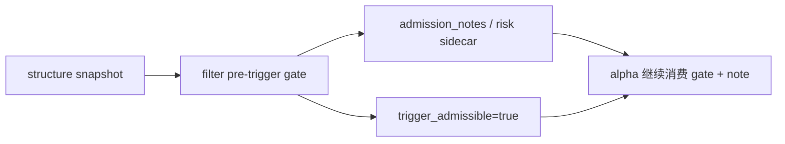

# filter pre-trigger boundary and authority reset 证据
`证据编号`：`62`
`日期`：`2026-04-15`

## 实现与验证命令

1. `filter / alpha / system` 联动单测

```bash
python -m pytest tests/unit/filter/test_runner.py tests/unit/alpha/test_runner.py tests/unit/alpha/test_family_runner.py tests/unit/alpha/test_pas_runner.py tests/unit/system/test_canonical_malf_rebind.py
```

- 结果：通过
- 摘要：`21 passed in 36.24s`

2. 文档先行门禁

```bash
python scripts/system/check_doc_first_gating_governance.py
```

- 结果：通过
- 摘要：当前待施工卡 `62-filter-pre-trigger-boundary-and-authority-reset-card-20260415.md` 已具备 requirement / design / spec / task breakdown 与历史账本约束

## 本轮落地事实

### 1. `filter` 不再替 `alpha` 做结构性 hard block

`src/mlq/filter/filter_materialization.py` 已把下列条件从 hard block 降为 note/risk：

1. `structure_progress_failed`
2. `reversal_stage_pending`

当前口径：

- `trigger_admissible` 只表达 pre-trigger gate 是否放行
- `structure_progress_failed / reversal_stage_pending` 只进入 `admission_notes`
- `break_confirmation / exhaustion_risk / reversal_probability` 继续以只读 sidecar 身份保留

### 2. 联动口径已经传导到 `alpha`

本轮没有直接改写 `alpha` 生产逻辑，但由于 `filter.trigger_admissible` 的含义已收窄：

- `alpha_formal_signal_event` 对这些样本不再生成 `blocked`
- `alpha` 当前仍把 `formal_signal_status <- filter.trigger_admissible` 作为临时实现
- `65` 继续保留为正式接回 blocked/admitted authority 的后续卡

### 3. 设计与规格已同步

已同步刷新：

1. `docs/01-design/modules/filter/01-filter-formal-snapshot-charter-20260409.md`
2. `docs/02-spec/modules/filter/01-filter-formal-snapshot-spec-20260409.md`

新增正式事实：

- `filter` 只做 pre-trigger admission
- `trigger_admissible` 不再承载结构性 hard verdict
- `filter -> alpha` 当前只透传 gate 结果与 note/risk，上游 authority reset 在 `62` 固化，最终 formal signal authority 重分配留给 `65`

## 关键样本摘要

1. `tests/unit/filter/test_runner.py`
   - `structure_progress=failed` 样本现在 `trigger_admissible=True`
   - `primary_blocking_condition=NULL`
   - `admission_notes` 保留结构观察说明
2. `tests/unit/filter/test_runner.py`
   - 新增 `reversal_stage_pending=trigger` 样本
   - 仍然 `trigger_admissible=True`
   - `admission_notes` 追加 pending 提示
3. `tests/unit/system/test_canonical_malf_rebind.py`
   - 全链路 `structure -> filter -> alpha` 已切到新口径
   - 原先被 `filter` 提前拦截的样本现在进入 `alpha`，保持 authority 不再前置于 `filter`

## 变更文件

| 类型 | 路径 | 说明 |
| --- | --- | --- |
| 代码 | `src/mlq/filter/filter_materialization.py` | 将结构裁决从 hard block 降级为 note/risk |
| 测试 | `tests/unit/filter/test_runner.py` | 更新结构失败样本预期，并新增 `reversal_stage_pending` note 用例 |
| 测试 | `tests/unit/alpha/test_runner.py` | 更新 formal signal 对新 pre-trigger 口径的联动预期 |
| 测试 | `tests/unit/system/test_canonical_malf_rebind.py` | 更新全链路 canonical rebind 预期 |
| 设计 | `docs/01-design/modules/filter/01-filter-formal-snapshot-charter-20260409.md` | 写清 `filter` 不再输出结构性 hard verdict |
| 规格 | `docs/02-spec/modules/filter/01-filter-formal-snapshot-spec-20260409.md` | 写清 `trigger_admissible` 只表示 pre-trigger gate |
| 执行 | `docs/03-execution/62-*.md` | 回填 `62` evidence / record / conclusion |

## 证据结构图


