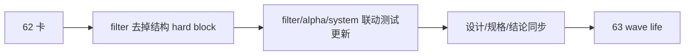

# filter pre-trigger boundary and authority reset 记录
`记录编号`：`62`
`日期`：`2026-04-15`

## 执行过程

1. 复核 `62` 卡、`filter` 模块设计与 `65` 卡，确认本轮目标是把 `filter` 收回到 pre-trigger 边界，而不是提前在 `62` 内改写 `alpha formal signal` 的 authority 分配。
2. 定位 `src/mlq/filter/filter_materialization.py`，确认当前唯一 hard block 来源就是：
   - `structure_progress_failed`
   - `reversal_stage_pending`
3. 改写 `filter` 物化逻辑：
   - 移除上述两类 blocking condition
   - 改为在 `admission_notes` 中保留结构观察
4. 更新 `filter / alpha / system` 联动测试，把预期切到“pre-trigger 放行 + note/risk 透传”。
5. 刷新 `filter` 的设计与规格文档，把 `trigger_admissible` 的正式语义收窄为 pre-trigger gate。
6. 回填 `62` 的 evidence / record / conclusion，并把执行索引、入口文件与最新生效锚点推进到 `62 -> 63`。

## 关键判断

### 1. `62` 只做 boundary reset，不做 final authority reallocation

本轮不直接改写 `alpha` 的 formal-signal status 生产规则，原因是：

1. `62` 的卡面边界只覆盖 `filter` 的 pre-trigger 职责
2. `65` 已经单独登记为 `formal signal admission boundary reallocation`
3. 如果在 `62` 里直接把 `alpha` 的 blocked/admitted 体系一并改掉，会把两张卡混写

因此本轮只做：

- `filter` 不再前置结构 verdict
- `alpha` 侧的联动预期随上游 truth 改变而更新

### 2. 允许短期出现“更多 admitted”的中间态

这不是回归，而是有意暴露 authority 边界：

1. 以前 `filter` 提前把结构 verdict 写死为 `blocked`
2. 现在 `filter` 只留下 note/risk
3. 最终哪些样本应被 `alpha formal signal` 降级、阻断或延后，留给 `64/65`

## 结果

1. `filter` 已回到 pre-trigger admission 边界。
2. `structure_progress_failed / reversal_stage_pending` 已从 hard block 降为 note/risk。
3. `trigger_admissible` 的正式含义已收窄，不再与结构 verdict 混写。
4. 当前最新生效结论锚点推进到 `62`，当前待施工卡推进到 `63`。

## 残留项

1. `alpha formal signal` 仍直接跟随 `filter.trigger_admissible` 生成 `formal_signal_status`。
2. 该 authority 偏上游的问题已经保留给 `65`，不在 `62` 内提前篡改。

## 记录结构图

