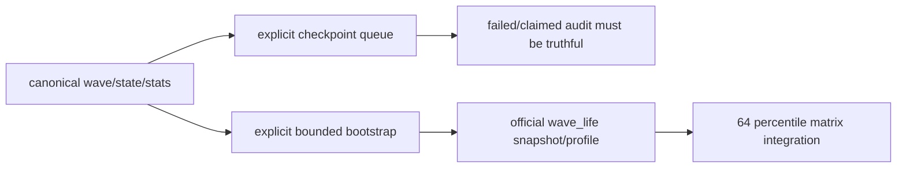

# wave life official ledger truthfulness and bootstrap 结论
`结论编号`：`63`
`日期`：`2026-04-15`
`状态`：`已完成`

## 裁决

- 接受：`36` 冻结的是 `wave_life` 的 schema 与 runner 合同，不等于官方库已经具备 `wave_life` 真值；`63` 开工时 `malf_wave_life_snapshot / profile / run / checkpoint / queue` 均为 `0`。
- 接受：`wave_life` 官方首跑必须使用显式 bounded window 做 bootstrap；`checkpoint queue` 只允许在显式声明下作为增量续跑入口。
- 接受：`scripts/malf/run_malf_wave_life_build.py` 现在必须显式二选一：
  - 提供 `signal_start_date / signal_end_date` 做 bounded bootstrap
  - 或传入 `--use-checkpoint-queue` 做增量 queue
- 接受：本卡内一次被打断的隐式 queue 试跑已被修复为真实审计状态：
  - `1` 条 `run_status='failed'`
  - `5000` 条 `queue_status='failed'`
  - 失败 run 写入的 `3082` 条 `snapshot` 已删除
- 接受：显式 bounded bootstrap 已在官方库上被真实证明；`card63-wave-life-bounded-script-001` 对 `601088.SH / D / 2010` 输出 `10` 条 profile 与 `242` 条 snapshot，且 `fallback_profile_count=0`。
- 接受：在 `64` 收口前，`wave_life_percentile / remaining_life_bars_* / termination_risk_bucket` 仍不得被写成 `alpha / position` 的官方 hard gate；`wave_life` 继续保持 `malf` 侧只读 sidecar。
- 拒绝：把空表、失败 queue 或 schema 存在本身继续解释成“wave_life official truth 已成立”。
- 拒绝：让无参脚本在官方空库上静默进入 queue 首跑。

## 原因

### 1. 上游真值充足，空表只能说明官方 sidecar 没有真正落地

本卡盘点时：

1. `malf_state_snapshot = 496777`
2. `malf_wave_ledger = 221628`
3. `malf_same_level_stats = 60988`

因此 `wave_life` 的空表不是“上游没有源数据”，而是“官方库从未完成 materialization truth”。

### 2. 隐式 queue 首跑会让审计账本失真

官方空库上直接走默认 queue 的结果是：

1. 生成 `running` run
2. 生成 `claimed` queue
3. 留下部分 `snapshot`
4. 但没有形成 `checkpoint`

这会把“首跑未收口”伪装成“库里已经有一部分事实”，不符合历史账本的 truthfulness 要求。

### 3. 显式 bounded bootstrap 已足以证明首跑路径成立

单标的 `2010` bounded bootstrap 已在真实正式库上产出：

1. `profile_row_count = 10`
2. `snapshot_row_count = 242`
3. `completed_wave_sample_count = 199868`
4. `fallback_profile_count = 0`

这说明 `wave_life` 的正式首跑路径是成立的，只是必须显式 bounded，而不是隐式 queue。

### 4. downstream 还没有正式绑定 `wave_life` 百分位

代码搜索显示 `wave_life_percentile / remaining_life_bars_p50 / termination_risk_bucket` 仍只出现在：

1. `src/mlq/malf/*`
2. `tests/unit/malf/*`
3. `docs/03-execution/*`

`structure / filter / alpha / position` 还没有把这些字段接成正式 authority 输入，因此 `63` 只裁决官方真值与 bootstrap，不越界改写 `64` 的 percentile decision matrix。

## 影响

1. 当前最新生效结论锚点推进到 `63-wave-life-official-ledger-truthfulness-and-bootstrap-conclusion-20260415.md`。
2. 当前待施工卡推进到 `64-alpha-stage-percentile-decision-matrix-integration-card-20260415.md`。
3. `wave_life` 官方库现在不再是全空，但当前官方真值仍只证明了 bounded bootstrap 样本：
   - `malf_wave_life_snapshot = 242`
   - `malf_wave_life_profile = 10`
   - `malf_wave_life_checkpoint = 0`
   - `malf_wave_life_run` 为 `completed=2 / failed=1`
   - `malf_wave_life_work_queue(queue_status='failed') = 5000`
4. 后续任何官方 `wave_life` 补建仓都必须先走显式 bounded window；增量 queue 只允许通过显式 `--use-checkpoint-queue` 进入。
5. `64` 起才允许讨论 `wave_life` 百分位如何进入 `alpha / position` 的正式判定矩阵；在此之前不得把其缺失写成 pre-trigger 或 formal-signal hard block。

## 六条历史账本约束检查

| 项目 | 当前状态 | 说明 |
| --- | --- | --- |
| 实体锚点 | 已满足 | `asset_type + code + timeframe + wave_id` 未改 |
| 业务自然键 | 已满足 | `instrument + timeframe + wave_nk` 与 `snapshot_nk / profile_nk` 继续作为正式主语义 |
| 批量建仓 | 已满足 | 显式 bounded bootstrap 已在官方库上验证成立 |
| 增量更新 | 有条件满足 | queue/replay 合同存在，但必须显式 `--use-checkpoint-queue`，且当前官方 `checkpoint` 仍待后续批次补齐 |
| 断点续跑 | 有条件满足 | 失败 run / failed queue 已进入真实审计状态，可供后续 replay；不再允许无参脚本静默首跑 |
| 审计账本 | 已满足 | `run / work_queue / checkpoint / snapshot / profile` 与 `63` evidence / record / conclusion 已形成闭环 |

## 结论结构图

