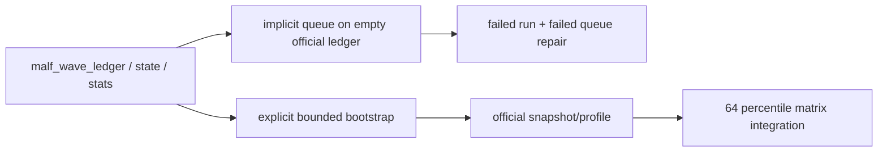

# wave life official ledger truthfulness and bootstrap 证据
`证据编号`：`63`
`日期`：`2026-04-15`

## 实现与验证命令

1. `wave_life` runner 单测

```bash
python -m pytest -p no:cacheprovider --basetemp H:\Lifespan-temp\pytest\card63_wave_life_20260415 tests/unit/malf/test_wave_life_runner.py tests/unit/malf/test_wave_life_explicit_queue_mode.py -q
```

- 结果：通过
- 摘要：`4 passed in 2.49s`

2. 官方脚本无参调用防呆

```bash
python scripts/malf/run_malf_wave_life_build.py
```

- 结果：按预期失败
- 摘要：抛出 `ValueError`，明确要求二选一：
  - 提供 `signal_start_date / signal_end_date` 做 bounded bootstrap
  - 或显式传入 `--use-checkpoint-queue` 做增量 queue

3. 官方库单标的 bounded bootstrap

```bash
python scripts/malf/run_malf_wave_life_build.py --signal-start-date 2010-01-01 --signal-end-date 2010-12-31 --instrument 601088.SH --timeframe D --limit 500 --run-id card63-wave-life-bounded-script-001
```

- 结果：通过
- 摘要：
  - `execution_mode=bounded_window`
  - `bounded_scope_count=1`
  - `profile_row_count=10`
  - `snapshot_row_count=242`
  - `completed_wave_sample_count=199868`
  - `fallback_profile_count=0`

## 本轮取证事实

### 1. `63` 开工时官方 `wave_life` 真值为空

对 `H:\Lifespan-data\malf\malf.duckdb` 的卡前盘点显示：

1. `malf_state_snapshot = 496777`
2. `malf_wave_ledger = 221628`
3. `malf_same_level_stats = 60988`
4. `malf_wave_life_snapshot / profile / run / checkpoint / queue = 0`

这说明 `36` 冻结的是 schema + runner 合同，不等于官方库已经有可消费 `wave_life` 真值。

### 2. 隐式 queue 首跑会把官方审计账本带入失真状态

本卡内一次无参 queue 试跑在官方库上留下了：

1. `1` 条 `checkpoint_queue` run
2. `5000` 条 `malf_wave_life_work_queue`
3. `3082` 条由失败 run 写入的 `snapshot`

这些中间状态已在本卡内修复为真实审计状态：

1. 失败 run 改记为 `run_status='failed'`
2. `5000` 条 queue 统一改记为 `queue_status='failed'`
3. 失败 run 写入的 `3082` 条 `snapshot` 已删除，不再冒充正式真值

### 3. 显式 bounded bootstrap 已在官方库证明可用

本卡最终保留的官方库事实为：

1. `malf_wave_life_snapshot = 242`
2. `malf_wave_life_profile = 10`
3. `malf_wave_life_checkpoint = 0`
4. `malf_wave_life_run` 为 `completed=2 / failed=1`
5. `malf_wave_life_work_queue(queue_status='failed') = 5000`

这证明：

1. 显式 bounded bootstrap 能生成真实 `snapshot / profile`
2. `checkpoint queue` 作为增量续跑账本仍存在，但不能再被当作空库首跑默认入口

### 4. 下游当前仍未正式绑定 `wave_life` 百分位字段

仓内搜索 `wave_life_percentile / remaining_life_bars_p50 / termination_risk_bucket` 的结果只落在：

1. `src/mlq/malf/*`
2. `tests/unit/malf/*`
3. `docs/03-execution/*`

未发现 `structure / filter / alpha / position` 的正式实现直接消费这些字段；这与官方库现状一致，说明 `wave_life` 仍是 `malf` 侧只读 sidecar，而非已生效的 downstream authority 输入。

## 变更文件

| 类型 | 路径 | 说明 |
| --- | --- | --- |
| 代码 | `src/mlq/malf/wave_life_runner.py` | 增加官方脚本显式执行模式校验 |
| 脚本 | `scripts/malf/run_malf_wave_life_build.py` | 增加 `--use-checkpoint-queue` 并禁止与 bounded selector 混用 |
| 测试 | `tests/unit/malf/test_wave_life_explicit_queue_mode.py` | 覆盖显式 queue 模式防呆与放行 |
| 设计 | `docs/01-design/modules/malf/13-malf-wave-life-probability-sidecar-charter-20260411.md` | 写清 official bootstrap/queue 边界 |
| 规格 | `docs/02-spec/modules/malf/13-malf-wave-life-probability-sidecar-spec-20260411.md` | 写清脚本必须显式选择执行模式 |
| 执行 | `docs/03-execution/63-*.md` | 回填 `63` evidence / record / conclusion |

## 证据结构图


