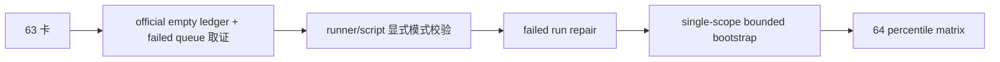

# wave life official ledger truthfulness and bootstrap 记录
`记录编号`：`63`
`日期`：`2026-04-15`

## 执行过程

1. 复核 `63` 卡、`36` 结论、`59` truthfulness gate 和 `Ω` 路线图，确认本轮目标不是直接把 `wave_life` 接进 `alpha`，而是先裁决官方库真值状态与 bootstrap/replay 边界。
2. 盘点 `H:\Lifespan-data\malf\malf.duckdb`，确认 `malf_state_snapshot / malf_wave_ledger / malf_same_level_stats` 已有真值，但 `malf_wave_life_*` 五表族在开工时全部为 `0`。
3. 试跑无参 `wave_life` queue 后发现：官方空库首跑会留下 `running` run、`claimed` queue 和部分 `snapshot` 行，说明“无参默认 queue”不适合继续作为官方首跑入口。
4. 修改 `wave_life` runner 与脚本：
   - 对官方脚本引入显式执行模式校验
   - 增加 `--use-checkpoint-queue`
   - 禁止 queue 与 bounded selector 混用
5. 增加 `tests/unit/malf/test_wave_life_explicit_queue_mode.py`，锁住：
   - 无参官方脚本入口必须报错
   - 显式 `use_checkpoint_queue=True` 仍可进入增量 queue
6. 修复刚才那次被打断的官方 queue 审计状态：
   - `run_status='running' -> 'failed'`
   - `queue_status='claimed' -> 'failed'`
   - 删除失败 run 写入的部分 `snapshot`
7. 用单标的 `2010` bounded window 在官方库上完成一次显式 bootstrap，证明 `snapshot / profile` 可以在真实正式库中落出非零真值。
8. 回填 `63` 的 evidence / record / conclusion，并把执行索引、路线图与入口文件推进到 `63 -> 64`。

## 关键判断

### 1. `36` 的“已落表”不能继续被解释成“官方库已有真值”

`36` 证明的是：

1. 表族存在
2. runner 存在
3. 单元测试存在

但 `63` 盘点到官方库 `malf_wave_life_*` 开工时全空，因此这部分事实必须被重新定性为：

- schema/contract 已冻结
- official materialized truth 直到 `63` 前并未成立

### 2. 首跑 bootstrap 与增量 queue 必须拆成两条显式路径

本轮的核心不是发明新算法，而是把“怎么跑”写成正式合同：

1. 首跑或历史补建仓：显式 bounded window
2. checkpoint/resume：显式 `--use-checkpoint-queue`

如果继续允许无参脚本静默进入 queue，就会在官方空库上留下真假难分的 `running/claimed/partial snapshot` 审计痕迹。

### 3. `wave_life` 仍未取得 downstream authority

本轮未改 `structure / filter / alpha / position` 的正式消费逻辑，原因是：

1. 代码搜索显示 `wave_life_percentile` 仍只停留在 `malf`
2. `64` 已明确登记为 `alpha stage percentile decision matrix integration`
3. 在 `64` 之前，不能把 `wave_life` 空缺或样本不足写成 `filter / alpha / position` 的 hard gate

## 结果

1. `wave_life` 官方库真值状态已被重新裁决，不再把空表误记为“已落地”。
2. `wave_life` 官方脚本入口已具备显式 bootstrap / queue 分流防呆。
3. 官方库已经存在非零 `wave_life_snapshot / profile` 真值样本。
4. 当前待施工卡推进到 `64-alpha-stage-percentile-decision-matrix-integration-card-20260415.md`。

## 残留项

1. 当前官方库 `malf_wave_life_checkpoint` 仍为 `0`，说明本卡只证明了显式 bounded bootstrap 真值，不等于已经完成全量 queue/resume 对齐。
2. `5000` 条 `failed` queue 仍保留在审计账本中，供后续显式 queue replay 使用。
3. `wave_life` 百分位如何进入 `alpha / position` 正式判定，留给 `64` 收口。

## 记录结构图

