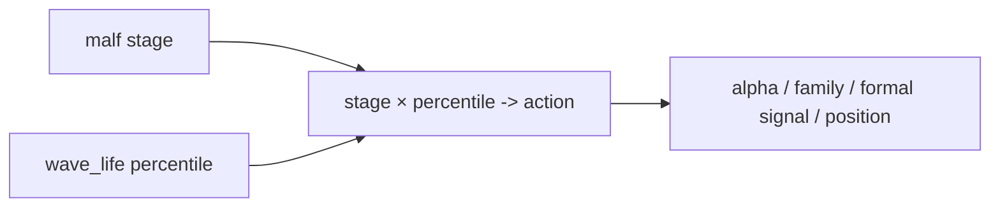

# alpha stage percentile decision matrix integration card

`卡号：64`
`日期：2026-04-15`
`状态：待施工`

## 需求

- 问题：`.windsurfrules` 已明确 `stage × percentile -> action` 是 `alpha` 层的重要未来输入，但当前 PAS detector / family / formal signal 均未正式消费该矩阵。
- 目标结果：裁决寿命分位数应接入 `detector / family / formal_signal / position` 的哪一层，以及 action 是触发、降级、阻断还是缩仓。
- 为什么现在做：`63` 已把 `wave_life` 官方真值与 bootstrap/replay 边界裁清；如果 `64` 不先冻结 percentile decision matrix，后续 `65` 的 admission authority 重分配仍会缺少明确的 stage 归属。

## 设计输入

- `docs/01-design/modules/malf/13-malf-wave-life-probability-sidecar-charter-20260411.md`
- `docs/02-spec/modules/malf/13-malf-wave-life-probability-sidecar-spec-20260411.md`
- `.windsurfrules`
- `docs/03-execution/36-malf-wave-life-probability-sidecar-bootstrap-conclusion-20260412.md`
- `docs/03-execution/42-alpha-family-role-and-malf-alignment-conclusion-20260413.md`
- `docs/03-execution/59-mainline-middle-ledger-2010-truthfulness-gate-conclusion-20260414.md`

## 任务分解

1. 盘点当前 `alpha detector / family / formal signal / position` 对 `wave_life` 字段的真实消费情况。
2. 设计并冻结 `stage × percentile -> action` 的正式接入点、优先级与降级路径。
3. 回填 `64` evidence / record / conclusion，并为后续代码施工准备正式合同。

## 实现边界

- 本卡只冻结 decision matrix 的接入层与合同。
- 本卡不直接恢复 `trade/system`。
- 本卡不允许把寿命概率回写进 `malf core`。

## 历史账本约束

- 实体锚点：`asset_type + code + signal_date + trigger_code`
- 业务自然键：`instrument + signal_date + trigger_code + family_role`
- 批量建仓：允许按窗口重物化 `alpha trigger/family/formal signal`
- 增量更新：仍以 `alpha trigger checkpoint / rematerialize` 驱动
- 断点续跑：不得让临时实验矩阵绕过正式账本
- 审计账本：`alpha_*_run / event / run_event` 与 `64-* evidence / record / conclusion`

## 收口标准

1. `stage × percentile -> action` 的正式接入层已冻结。
2. `wave_life` 对 `alpha/position` 的作用方式已有明文裁决。
3. 后续实现不再依赖口头解释，而有正式 spec 入口。

## 卡片结构图

