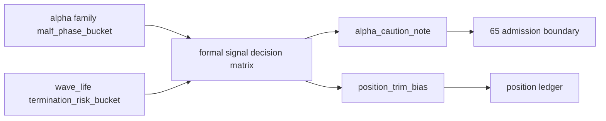

# alpha stage percentile decision matrix integration 结论
`结论编号`：`64`
`日期`：`2026-04-15`
`状态`：`已完成`

## 裁决

- 接受：`wave_life` 百分位的正式下游接入点冻结在 `alpha formal signal`，而不是 `alpha PAS detector / trigger / family`。
- 接受：`alpha family` 继续负责输出 `malf_phase_bucket`；`alpha formal signal` 才允许把 `malf_phase_bucket × termination_risk_bucket` 融合成标准 decision matrix。
- 接受：`alpha formal signal` 正式合同已升级为 `alpha-formal-signal-v4`，并新增 `wave_life_percentile / remaining_life_bars_p50 / remaining_life_bars_p75 / termination_risk_bucket / stage_percentile_*` 字段族。
- 接受：`stage_percentile_decision_code` 当前正式冻结为 `observe_only / alpha_caution_note / position_trim_bias` 三档；`stage_percentile_action_owner` 当前正式冻结为 `none / alpha_note / position`。
- 接受：`position` 已接通上述 explanatory sidecar 输入，但 `position_trim_bias` 仍只代表 `position` 层的后续动作权，不在 `64` 内提前落成 sizing/trim 行为。
- 接受：`scripts/alpha/run_alpha_formal_signal_build.py` 现已显式暴露 `--source-wave-life-table`，默认读取 `malf_wave_life_snapshot`。
- 拒绝：在 `64` 内把 `wave_life` 百分位直接改写为 `formal_signal_status` 的 hard gate。
- 拒绝：在 `64` 内把 `wave_life` 反向写回 `malf core`、`alpha family` 或 `filter` 的结构性 authority。

## 原因

### 1. `63` 只裁清了 `wave_life` 官方真值，不等于下游 authority 已冻结

`63` 证明的是：

1. 官方 `wave_life` 已有真实 `snapshot / profile` 样本
2. `wave_life` 仍是 `malf` 侧只读 sidecar
3. 下游还没有冻结谁来解释 `stage × percentile`

因此 `64` 必须先把接入层定下来，不能跳过 formal signal 直接把 percentile 写成 admission 或 sizing 真值。

### 2. `alpha family` 与 `alpha formal signal` 的职责需要拆开

`alpha family` 已在 `42` 收口时冻结为 family role/alignment/stage 来源；若让它直接读取 `wave_life`，会把 stage 来源和 risk 解释耦死。把融合动作放到 `alpha formal signal`，可以保持：

1. family 只负责 stage 归类
2. formal signal 只负责下游解释层冻结
3. `65` 仍有空间单独重排 admission authority

### 3. `position_trim_bias` 只能由 `position` 落成正式动作

`wave_life` 百分位提供的是寿命风险提示，而不是 `alpha` 层可以直接执行的仓位动作。若在 `64` 内把它提前写成 `alpha` hard gate 或直接 sizing，会越过 `position` 的正式账本边界。

## 影响

1. 当前最新生效结论锚点推进到 `64-alpha-stage-percentile-decision-matrix-integration-conclusion-20260415.md`。
2. 当前待施工卡推进到 `65-formal-signal-admission-boundary-reallocation-card-20260415.md`。
3. `alpha formal signal` 现在可以稳定输出 `wave_life` 相关 explanatory sidecar，供 `position` 与后续 admission 重分配消费。
4. `64` 之后的 admission authority 调整必须继续在 `65` 内完成，不得回退到 `filter` 或把 `alpha` 变成 sizing 执行层。

## 六条历史账本约束检查

| 项目 | 当前状态 | 说明 |
| --- | --- | --- |
| 实体锚点 | 已满足 | 仍以 `asset_type + code` 为标的稳定锚点，`alpha formal signal` 与 `position` 只是在既有事件/输入行上补 sidecar 字段 |
| 业务自然键 | 已满足 | `signal_nk` 与 `candidate_nk` 未改写；新增字段不替代自然键 |
| 批量建仓 | 已满足 | `alpha formal signal` bounded build 现可在 bootstrap 时一次性物化 `wave_life` sidecar 与 decision matrix |
| 增量更新 | 已满足 | checkpoint queue / rematerialize 路径继续沿用既有 `alpha formal signal` 账本语义 |
| 断点续跑 | 已满足 | `run / checkpoint / run_event` 合同未破坏；新增 sidecar 字段进入重算与 rematerialize 比对 |
| 审计账本 | 已满足 | `alpha_formal_signal_run / event / run_event` 与 `64` 的 evidence / record / conclusion 已形成闭环 |

## 结论结构图

