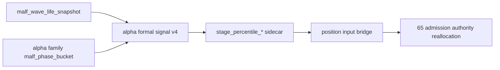

# alpha stage percentile decision matrix integration 证据
`证据编号`：`64`
`日期`：`2026-04-15`

## 实现与验证命令

1. 语法与导入校验

```bash
python -m py_compile src/mlq/alpha/formal_signal_shared.py src/mlq/alpha/formal_signal_source.py src/mlq/alpha/formal_signal_materialization.py src/mlq/alpha/runner.py src/mlq/alpha/__init__.py src/mlq/position/position_shared.py src/mlq/position/position_runner_support.py scripts/alpha/run_alpha_formal_signal_build.py tests/unit/alpha/test_runner.py tests/unit/alpha/test_formal_signal_runner.py tests/unit/position/test_position_runner.py
```

- 结果：通过

2. `alpha formal signal / position bridge` 定向单测

```bash
python -m pytest -p no:cacheprovider --basetemp H:\Lifespan-temp\pytest\card64_alpha_stage_percentile_20260415 tests/unit/alpha/test_formal_signal_runner.py tests/unit/alpha/test_runner.py tests/unit/position/test_position_runner.py -q
```

- 结果：通过
- 摘要：`14 passed, 1 warning in 88.08s`

3. doc-first gating

```bash
python scripts/system/check_doc_first_gating_governance.py
```

- 结果：通过

4. 改动路径治理检查

```bash
python scripts/system/check_development_governance.py docs/01-design/modules/alpha/07-alpha-stage-percentile-decision-matrix-charter-20260415.md docs/02-spec/modules/alpha/07-alpha-stage-percentile-decision-matrix-spec-20260415.md docs/03-execution/00-conclusion-catalog-20260409.md docs/03-execution/64-alpha-stage-percentile-decision-matrix-integration-card-20260415.md docs/03-execution/64-alpha-stage-percentile-decision-matrix-integration-evidence-20260415.md docs/03-execution/64-alpha-stage-percentile-decision-matrix-integration-record-20260415.md docs/03-execution/64-alpha-stage-percentile-decision-matrix-integration-conclusion-20260415.md docs/03-execution/65-formal-signal-admission-boundary-reallocation-card-20260415.md docs/03-execution/A-execution-reading-order-20260409.md docs/03-execution/B-card-catalog-20260409.md docs/03-execution/C-system-completion-ledger-20260409.md src/mlq/alpha/__init__.py src/mlq/alpha/bootstrap.py src/mlq/alpha/formal_signal_materialization.py src/mlq/alpha/formal_signal_shared.py src/mlq/alpha/formal_signal_source.py src/mlq/alpha/runner.py src/mlq/position/position_runner_support.py src/mlq/position/position_shared.py scripts/alpha/run_alpha_formal_signal_build.py tests/unit/alpha/test_formal_signal_runner.py tests/unit/alpha/test_runner.py tests/unit/position/test_position_runner.py AGENTS.md README.md pyproject.toml
```

- 结果：通过

## 本轮取证事实

### 1. `wave_life` 正式接入点已冻结在 `alpha formal signal`

本轮代码改动显示：

1. `alpha PAS detector` 与 `alpha trigger` 未接入 `wave_life`
2. `alpha family` 继续只负责 `family_role / family_bias / malf_alignment / malf_phase_bucket`
3. `alpha formal signal` 新增对 `malf_wave_life_snapshot` 的只读消费，并把 `wave_life_percentile / remaining_life_bars_p50 / remaining_life_bars_p75 / termination_risk_bucket` 物化到 `alpha_formal_signal_event`

### 2. 决策矩阵只落解释性 sidecar，不改 admission authority

本轮冻结的正式字段包括：

1. `stage_percentile_decision_code`
2. `stage_percentile_action_owner`
3. `stage_percentile_note`
4. `stage_percentile_contract_version`

当前正式 decision code 与 owner 为：

1. `observe_only -> none`
2. `alpha_caution_note -> alpha_note`
3. `position_trim_bias -> position`

上述字段已落入 `alpha_formal_signal_event / alpha_formal_signal_run_event`，但未改写 `formal_signal_status`。

### 3. `position` 已接通 sidecar 透传，但仍未提前执行 trim/sizing

`position_runner_support.py` 与 `PositionFormalSignalInput` 已能读取并保留：

1. `wave_life_percentile`
2. `remaining_life_bars_p50 / p75`
3. `termination_risk_bucket`
4. `stage_percentile_*`

当前证据只证明上游输入桥已完成，不证明 `position` 已把这些字段升级成正式 sizing 行为；这仍符合 `64` 的边界。

### 4. 正式脚本入口已与新 sidecar 来源对齐

`scripts/alpha/run_alpha_formal_signal_build.py` 已新增 `--source-wave-life-table`，默认指向 `malf_wave_life_snapshot`，与 `src/mlq/alpha/__init__.py` 的导出常量保持一致。

## 变更文件

| 类型 | 路径 | 说明 |
| --- | --- | --- |
| 设计 | `docs/01-design/modules/alpha/07-alpha-stage-percentile-decision-matrix-charter-20260415.md` | 冻结 `stage × percentile` 接入层与边界 |
| 规格 | `docs/02-spec/modules/alpha/07-alpha-stage-percentile-decision-matrix-spec-20260415.md` | 冻结 `alpha formal signal` 与 `position` 的字段合同 |
| 代码 | `src/mlq/alpha/formal_signal_shared.py` | 新增 decision matrix 常量、sidecar 字段与判定函数 |
| 代码 | `src/mlq/alpha/formal_signal_source.py` | 只读接入 `malf_wave_life_snapshot` |
| 代码 | `src/mlq/alpha/formal_signal_materialization.py` | 物化 `wave_life` sidecar 与 `stage_percentile_*` 字段 |
| 代码 | `src/mlq/alpha/bootstrap.py` | 补齐 `alpha_formal_signal_event / run_event` 新列 |
| 代码 | `src/mlq/position/position_shared.py` | 扩展 `PositionFormalSignalInput` |
| 代码 | `src/mlq/position/position_runner_support.py` | 接通 `alpha formal signal` 新字段 |
| 脚本 | `scripts/alpha/run_alpha_formal_signal_build.py` | 暴露 `--source-wave-life-table` |
| 测试 | `tests/unit/alpha/test_formal_signal_runner.py` | 覆盖 `wave_life` sidecar 与 decision matrix 输出 |
| 测试 | `tests/unit/alpha/test_runner.py` | 提供 `wave_life snapshot` seed helper |
| 测试 | `tests/unit/position/test_position_runner.py` | 对齐 `alpha formal signal v4` |

## 证据结构图

