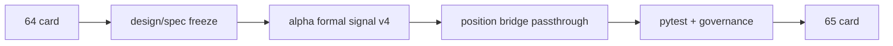

# alpha stage percentile decision matrix integration 记录
`记录编号`：`64`
`日期`：`2026-04-15`

## 执行过程

1. 复核 `.windsurfrules`、`42` 结论、`63` 结论与 `65` 卡，确认 `64` 只负责冻结 `stage × percentile` 接入层，不直接改 admission authority。
2. 新增 `docs/01-design/modules/alpha/07-alpha-stage-percentile-decision-matrix-charter-20260415.md` 与 `docs/02-spec/modules/alpha/07-alpha-stage-percentile-decision-matrix-spec-20260415.md`，把合同写成正式 design/spec 输入。
3. 在 `alpha formal signal` 侧补齐 `wave_life` 只读接入、decision matrix 判定函数、event/run_event 新列与 `alpha-formal-signal-v4` 合同版本。
4. 在 `position` 侧补齐 `alpha formal signal` 新字段透传，确保 `position` 可以消费 explanatory sidecar，但不提前把它写成正式 sizing 决策。
5. 为 `alpha`/`position` 链路补单测，并把 `scripts/alpha/run_alpha_formal_signal_build.py` 与 `src/mlq/alpha/__init__.py` 的入口常量同步到新 sidecar 来源。
6. 运行 `py_compile`、定向 `pytest`、doc-first gating 与按改动路径治理检查，确认 `64` 在代码、文档与入口文件上同时收口。

## 关键判断

### 1. `64` 不能越权替 `65` 改 admission

虽然 `wave_life` 百分位已经能提供风险侧信息，但 `65` 卡专门负责 `formal signal` admission authority 的重分配，因此本轮不能把 `termination_risk_bucket` 直接写成：

1. `filter` hard block
2. `formal_signal_status` 硬拦截
3. `position` 之外的正式 trim/sizing 动作

### 2. `alpha family` 继续是 stage 来源，`formal signal` 才做融合

本轮保留了两层职责分工：

1. `alpha family` 保持 `malf_phase_bucket` 的正式来源
2. `alpha formal signal` 负责把 `malf_phase_bucket × termination_risk_bucket` 冻结成标准 decision code

这样 `64` 不需要重写 family 语义，也不会把 `wave_life` 反向写回 `malf / family`。

### 3. `position_trim_bias` 必须继续归 `position`

即使 decision matrix 已经能给出 `position_trim_bias`，`64` 也只把它记成 `stage_percentile_action_owner='position'`。正式减仓、缩量或 sizing 仍需由 `position` 层在自己的账本内落表。

## 偏离项

- 首轮单测预期把 `000001.SZ` 的 family phase 当成 `middle`，但实际 family payload 落表为 `early`；已在测试中显式把该样本 payload 调整为 `middle`，确保 `alpha_caution_note` 分支有真实覆盖。

## 备注

1. 全仓无参 `python scripts/system/check_development_governance.py` 仍会因历史超长文件债务返回非零；本轮仅执行按改动路径的严格检查，结果通过。
2. `64` 收口后，下一张正式施工卡推进到 `65-formal-signal-admission-boundary-reallocation-card-20260415.md`。

## 记录结构图

