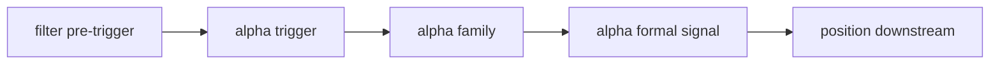

# formal signal admission boundary reallocation card

`卡号`：`65`
`日期`：`2026-04-15`
`状态`：`已完成`

## 需求

- 问题：当前 `alpha formal signal` 的 `admitted / blocked` 状态仍直接跟随 `filter.trigger_admissible`，说明 `62` 已把 `filter` 重置为 pre-trigger 门控后，formal signal admission authority 仍未真正回收到 `alpha`。
- 目标结果：冻结 `filter -> alpha trigger -> alpha family -> alpha formal signal` 的正式 admission 分权合同，明确谁负责 `admissible / blocked / downgrade / note-only` 的最终裁决与审计落点。
- 为什么现在做：`64` 已先把 `stage × percentile` 的解释性接入层冻结在 `alpha formal signal`；若不继续在 `65` 收回 admission authority，下游仍会把 `filter` 的 pre-trigger 结果误当成 `formal signal` 的最终裁决。

## 设计输入

- `docs/01-design/modules/alpha/01-alpha-formal-signal-output-charter-20260409.md`
- `docs/01-design/modules/alpha/06-alpha-formal-signal-producer-hardening-before-position-charter-20260413.md`
- `docs/02-spec/modules/alpha/01-alpha-formal-signal-output-and-producer-spec-20260409.md`
- `docs/02-spec/modules/alpha/06-alpha-formal-signal-producer-hardening-before-position-spec-20260413.md`
- `docs/03-execution/10-alpha-formal-signal-contract-and-producer-conclusion-20260409.md`
- `docs/03-execution/11-structure-filter-formal-contract-and-minimal-snapshot-conclusion-20260409.md`
- `docs/03-execution/45-alpha-formal-signal-producer-hardening-before-position-conclusion-20260413.md`
- `docs/03-execution/59-mainline-middle-ledger-2010-truthfulness-gate-conclusion-20260414.md`
- `docs/03-execution/62-filter-pre-trigger-boundary-and-authority-reset-conclusion-20260415.md`
- `docs/03-execution/64-alpha-stage-percentile-decision-matrix-integration-conclusion-20260415.md`

## 任务分解

1. 固化当前 `formal_signal_status <- filter.trigger_admissible` 的正式事实。
2. 设计 `filter`、`alpha trigger`、`alpha family`、`alpha formal signal` 各自持有的 verdict 权限与审计字段。
3. 冻结 `blocked / admitted / downgraded / note-only` 的正式落表层、输入边界与 run-level 审计合同。
4. 回填 `65` evidence / record / conclusion，并为后续实现改造留出正式边界。

## 实现边界

- 本卡只处理 admission authority 的分权与账本语义。
- 本卡不直接改动 `position sizing`、`trade runtime` 或 `system readout`。
- 若有字段变更，必须保持 `formal signal` 作为正式下游锚点不变。

## 历史账本约束

- 实体锚点：`asset_type + code + signal_date + trigger_code`
- 业务自然键：`trigger_event_nk / family_event_nk / formal_signal_event_nk`
- 批量建仓：允许按窗口重放 `alpha trigger / family / formal signal`
- 增量更新：沿现有 `trigger -> family -> formal signal` bounded 链续跑
- 断点续跑：不得把 `run_id` 当作 admission verdict 主键
- 审计账本：`alpha_trigger_event / alpha_family_event / alpha_formal_signal_event` 与 `65-* evidence / record / conclusion`

## 收口标准

1. `filter` 与 `alpha` 的 admission authority 已重新冻结。
2. `formal_signal` 的 `blocked / admitted` 来源与责任层已写清。
3. 后续整改实现可以在不扰乱主链的前提下施工。

## 卡片结构图

