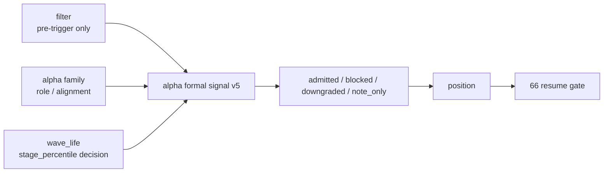

# formal signal admission boundary reallocation 结论
`结论编号`：`65`
`日期`：`2026-04-15`
`状态`：`已完成`

## 裁决

- 接受：`filter.trigger_admissible` 的正式语义固定为 pre-trigger gate，不再直接充当 `alpha formal signal` 的最终 admission verdict。
- 接受：`alpha formal signal` 取得最终 admission authority，并正式冻结 `admitted / blocked / downgraded / note_only` 四类 verdict。
- 接受：`alpha_formal_signal_event` 与 `alpha_formal_signal_run_event` 正式升级到 `alpha-formal-signal-v5`，新增 `admission_verdict_code / admission_verdict_owner / admission_reason_code / admission_audit_note / filter_gate_code / filter_reject_reason_code`。
- 接受：`formal_signal_status` 继续作为下游消费状态层存在，但它不再直接镜像 `trigger_admissible`；其生成改由 `filter pre-trigger + family role/alignment + stage_percentile decision` 联合裁决。
- 接受：`middle × high termination risk -> alpha_caution_note` 现在正式落为 `note_only`，而 `family_alignment='conflicted'` 正式落为 `downgraded`，两者都进入 `alpha formal signal` 审计账本。
- 接受：`position` 现在以 `formal_signal_status` 与 `admission_reason_code` 作为正式 candidate/status 来源，`trigger_admissible` 只保留为 filter pre-trigger 被挡住时的兜底语义。
- 拒绝：继续把 `filter` 当作结构性 blocked/admitted 裁决层。
- 拒绝：继续把 `stage_percentile_*` 永久停留在 explanation-only，而不进入 `alpha` 的正式 admission authority。
- 拒绝：在 `65` 内把 `position` sizing、`trade` 或 `system` 逻辑夹带回 `alpha formal signal`。

## 原因

### 1. `62` 只重置了 `filter` 边界，但还没有把最终 verdict 真正交还给 `alpha`

`62` 已经裁清：

1. `filter` 只负责 pre-trigger gate
2. 结构风险只能以下游 note/risk sidecar 方式保留
3. `alpha` 才是正式信号解释层

如果 `formal_signal_status` 仍然直接取自 `filter.trigger_admissible`，那 `filter` 只是从“结构性 hard block”变成了“换名后的 final verdict 层”，并没有真正退回边界内。

### 2. `64` 的 decision matrix 必须在 `65` 中落为正式 admission 决策

`64` 已经把 `stage × percentile` 的正式接入层冻结在 `alpha formal signal`。本轮若不把它纳入最终 verdict，则：

1. `alpha_caution_note` 永远只会停留在注释层
2. `wave_life` sidecar 无法形成正式审计事实
3. 下游仍需依赖口头解释猜测 `alpha` 对这些 sidecar 的真实态度

因此 `65` 必须把这部分权力正式写入 `alpha_formal_signal_event`。

### 3. `position` 只能消费 alpha-owned verdict，不能继续把 filter gate 误当正式 blocked 来源

`position` 的职责是单标的仓位计划与资金管理，不是替 `alpha` 补做 admission 裁决。`65` 收口后：

1. `alpha` 决定 `formal_signal_status`
2. `alpha` 提供 `admission_reason_code`
3. `position` 只在此基础上物化 candidate/risk/capacity/sizing

这保证了 `alpha -> position` 的权责关系重新闭环。

## 影响

1. 当前最新生效结论锚点推进到 `65-formal-signal-admission-boundary-reallocation-conclusion-20260415.md`。
2. 当前待施工卡推进到 `66-mainline-rectification-resume-gate-card-20260415.md`。
3. `60 -> 65` 已完成主线整改卡组中的 scope、truthfulness、filter boundary、wave_life truth、stage_percentile matrix 与 formal signal admission authority 回收。
4. `66` 之前仍不允许直接恢复 `80-86`；只有 `66` 接受后，才允许恢复 official middle-ledger resume 卡组。
5. `position` 继续只把 `stage_percentile_*` 当作只读 sidecar 输入，不得把 sizing/trim 动作权回推给 `alpha`。

## 六条历史账本约束检查

| 项目 | 当前状态 | 说明 |
| --- | --- | --- |
| 实体锚点 | 已满足 | 仍以 `asset_type + code` 为标的稳定锚点，`formal signal` 在此之上叠加 `signal_date + trigger 语义` |
| 业务自然键 | 已满足 | `signal_nk` 未变；`admission_verdict_*` 只是事件属性，不替代自然键 |
| 批量建仓 | 已满足 | bounded window 仍可按窗口重放 `alpha trigger / family / formal signal` |
| 增量更新 | 已满足 | `formal signal` 继续沿用 rematerialize 语义，并把 admission verdict 纳入重算 fingerprint |
| 断点续跑 | 已满足 | `run_id` 仍只做审计；`run_event` 记录 inserted / reused / rematerialized，不反客为主 |
| 审计账本 | 已满足 | `alpha_formal_signal_run / event / run_event` 与 `65` evidence / record / conclusion 已形成闭环 |

## 结论结构图

