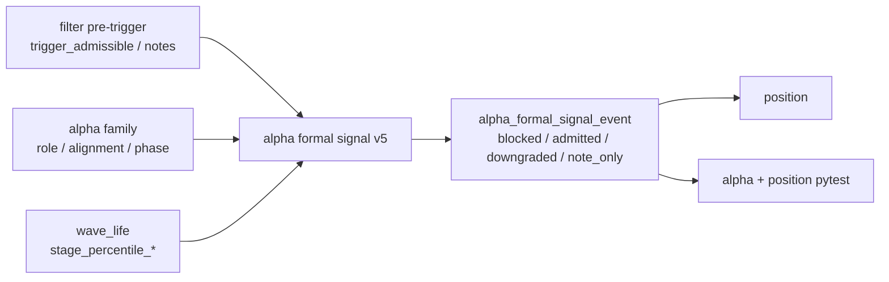

# formal signal admission boundary reallocation 证据
`证据编号`：`65`
`日期`：`2026-04-15`

## 实现与验证命令

1. `alpha formal signal` 与 `position` 相关单测

```bash
python -m pytest tests/unit/alpha/test_formal_signal_runner.py tests/unit/position/test_position_runner.py -q --basetemp H:\Lifespan-temp\pytest-tmp\65-smoke
```

- 结果：通过
- 摘要：`9 passed in 73.53s`

## 本轮取证事实

### 1. `formal_signal_status` 不再直接镜像 `filter.trigger_admissible`

本轮代码改动后，`alpha_formal_signal_event` 的 admission 结论改由 `alpha formal signal` 自身冻结：

1. `filter` 只继续提供 `trigger_admissible`、`primary_blocking_condition` 与 `admission_notes`
2. `alpha formal signal` 新增 `admission_verdict_code / admission_verdict_owner / admission_reason_code / admission_audit_note`
3. `formal_signal_status` 改为由 `filter pre-trigger + family role/alignment + stage_percentile decision` 共同裁决

### 2. `middle × high termination risk` 已落为 `note_only`

`tests/unit/alpha/test_formal_signal_runner.py` 的主样本现在可稳定得到：

1. `000001.SZ`
   - `formal_signal_status='deferred'`
   - `admission_verdict_code='note_only'`
   - `admission_verdict_owner='alpha_formal_signal'`
   - `admission_reason_code='stage_percentile_alpha_caution_note'`
2. 该样本同时保留 `stage_percentile_decision_code='alpha_caution_note'` 与 `stage_percentile_action_owner='alpha_note'`

### 3. `family_alignment='conflicted'` 已落为 `downgraded`

同一轮 alpha 单测的另一样本现在稳定得到：

1. `000002.SZ`
   - `formal_signal_status='deferred'`
   - `admission_verdict_code='downgraded'`
   - `admission_verdict_owner='alpha_formal_signal'`
   - `admission_reason_code='family_alignment_conflicted'`

### 4. rematerialize 已能追踪 admission verdict 变化

`test_run_alpha_formal_signal_build_marks_rematerialized_when_official_upstream_changes` 现在验证：

1. 初次物化仍可得到 `admitted`
2. 当上游结构上下文变化并把 family alignment 推成 `conflicted` 后
3. 同一 `signal_nk` 会被 `rematerialized`
4. 事件事实更新为：
   - `formal_signal_status='deferred'`
   - `admission_verdict_code='downgraded'`
   - `signal_contract_version='alpha-formal-signal-v5'`

### 5. `position` 已改为消费 alpha-owned verdict，而不是直接复用 filter gate

`tests/unit/position/test_position_runner.py` 全部通过，配合代码取证表明：

1. `resolve_candidate_status(...)` 现在优先以 `formal_signal_status` 作为 candidate 裁决来源
2. `blocked_reason_code` 现在优先使用 `alpha formal signal.admission_reason_code`
3. `trigger_admissible=false` 只在 filter pre-trigger 真被挡住时作为兜底阻断

## 变更文件

| 类型 | 路径 | 说明 |
| --- | --- | --- |
| 代码 | `src/mlq/alpha/formal_signal_shared.py` | 新增 admission verdict 推导与 `alpha-formal-signal-v5` 合同 |
| 代码 | `src/mlq/alpha/formal_signal_source.py` | 把 `filter` gate/reason/note 纳入正式上下文输入 |
| 代码 | `src/mlq/alpha/formal_signal_materialization.py` | 以 alpha-owned admission authority 物化 event/run_event |
| 代码 | `src/mlq/alpha/bootstrap.py` | 为 `alpha_formal_signal_event / run_event` 增补 admission/filter 审计字段 |
| 代码 | `src/mlq/position/position_runner_support.py` | 对齐新 formal signal 字段映射与下游读取 |
| 代码 | `src/mlq/position/position_contract_logic.py` | 改为以 formal signal verdict 决定 candidate status |
| 测试 | `tests/unit/alpha/test_formal_signal_runner.py` | 改为断言 `v5` admission contract |
| 文档 | `docs/03-execution/65-*.md` | 回填 `65` evidence / record / conclusion |

## 证据结构图

