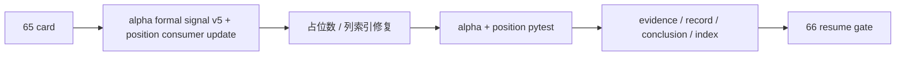

# formal signal admission boundary reallocation 记录
`记录编号`：`65`
`日期`：`2026-04-15`

## 执行过程

1. 先复核 `62`、`64` 与 `65` card，确认当前问题不是再讨论 `filter` 是否放行，而是把最终 admission authority 正式收回到 `alpha formal signal`
2. 盘点现状代码，确认旧实现仍把 `formal_signal_status <- filter.trigger_admissible` 写死在 `src/mlq/alpha/formal_signal_source.py` 与 materialization 链路中
3. 设计新的 admission 合同：
   - `filter` 只保留 `pre_trigger_passed / pre_trigger_blocked`
   - `alpha formal signal` 正式冻结 `admitted / blocked / downgraded / note_only`
   - `formal_signal_status` 继续保留对下游的 `admitted / blocked / deferred`
4. 在 `src/mlq/alpha/formal_signal_shared.py` 增加 admission 推导函数，把下列输入统一折叠为最终 verdict：
   - `trigger_admissible`
   - `family_role`
   - `malf_alignment`
   - `stage_percentile_decision_code`
   - `stage_percentile_action_owner`
   - `filter_reject_reason_code`
   - `filter_admission_notes`
5. 在 `src/mlq/alpha/bootstrap.py`、`formal_signal_source.py`、`formal_signal_materialization.py` 中补齐事件表与 run_event 表字段，并把 contract version 提升到 `alpha-formal-signal-v5`
6. 在 `position_runner_support.py` 与 `position_contract_logic.py` 收口下游消费边界，使 `position` 以 `formal_signal_status + admission_reason_code` 为主，`trigger_admissible` 只作 filter blocked 兜底
7. 先跑 `alpha + position` 单测，定位并修复两轮问题：
   - `run_event` 插入占位数不足
   - `position` 读取 `alpha_formal_signal_event` 的列索引错位
8. 在代码稳定后，更新 alpha 单测为 `v5` 行为断言，再次串行跑完：
   - `tests/unit/alpha/test_formal_signal_runner.py`
   - `tests/unit/position/test_position_runner.py`
9. 最后回填 `65` 执行区闭环，并同步刷新 `README.md`、`AGENTS.md`、`Ω` 路线图与 alpha/position 相关 design/spec 的正式口径

## 关键判断

### 1. `filter` 的权力边界必须停在 pre-trigger gate

`62` 已经把 `filter` 重新定义为 pre-trigger 层。如果 `formal_signal_status` 继续直接镜像 `trigger_admissible`，那只是把旧越界关系换了个表名继续保留，没有真正完成 authority reset。

### 2. `stage_percentile` 不能永远只做“解释性 sidecar”

`64` 已经把 `stage × percentile` 的正式接入层冻结在 `alpha formal signal`。如果 `65` 仍不让它参与最终 verdict，那么 `alpha_caution_note` 只会停留在注释层，无法形成可审计的正式 admission 决策。

### 3. 下游 `position` 不能继续把 `trigger_admissible` 当作正式 blocked 来源

`position` 若同时把 `formal_signal_status` 与 `trigger_admissible` 并列为同等级裁决源，就会在代码层把 `filter` 再次抬回正式 verdict 层。`65` 收口后，下游只能把 `trigger_admissible=false` 视作 “filter pre-trigger 真被挡住” 的特例，而不能继续用它解释所有 blocked/deferred。

## 结果

1. `alpha formal signal` 正式取得 final admission authority
2. `alpha_formal_signal_event / alpha_formal_signal_run_event` 增补 admission/filter 审计字段并升级到 `v5`
3. `position` 对 alpha 的正式消费边界与 `65` 新合同对齐
4. 当前最新生效结论锚点推进到 `65-formal-signal-admission-boundary-reallocation-conclusion-20260415.md`
5. 当前待施工卡前移到 `66-mainline-rectification-resume-gate-card-20260415.md`

## 残留项

1. `66` 仍需基于 `60-65` 的整改结论，正式判断主线整改卡组是否可以恢复到 `80-86`
2. 本轮没有恢复 `trade / system`，也没有改变 `position` 对 `stage_percentile_*` 的只读 sidecar 边界
3. 本轮没有把 `wave_life` 反写回 `malf core`，也没有把 `position` sizing 权回推到 `alpha`

## 记录结构图

