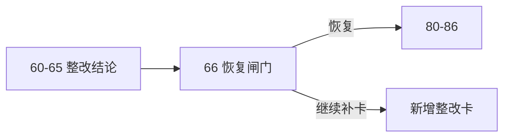

# mainline rectification resume gate card

`卡号：66`
`日期：2026-04-15`
`状态：待施工`

## 需求

- `60-65` 只是在主线恢复前把 scope、coverage、boundary、wave_life 与 admission authority 问题逐项裁决出来。
- 在这些整改结论形成前，不能继续把 `80-86` 当成默认续推卡组。
- 需要一张正式 gate 卡统一裁决：整改是否足够支持恢复 `80-86`，还是仍应继续补卡。

## 设计输入

- `docs/02-spec/Ω-system-delivery-roadmap-20260409.md`
- `docs/03-execution/59-mainline-middle-ledger-2010-truthfulness-gate-conclusion-20260414.md`
- `docs/03-execution/60-mainline-rectification-batch-registration-and-scope-freeze-card-20260415.md`
- `docs/03-execution/61-structure-filter-tail-coverage-truthfulness-rectification-card-20260415.md`
- `docs/03-execution/62-filter-pre-trigger-boundary-and-authority-reset-card-20260415.md`
- `docs/03-execution/63-wave-life-official-ledger-truthfulness-and-bootstrap-card-20260415.md`
- `docs/03-execution/64-alpha-stage-percentile-decision-matrix-integration-card-20260415.md`
- `docs/03-execution/65-formal-signal-admission-boundary-reallocation-card-20260415.md`

## 任务分解

1. 汇总 `60-65` 的裁决与遗留缺口。
2. 裁决 `80-86` 是否恢复、是否改写、还是继续追加整改卡。
3. 回填 `66` evidence / record / conclusion，并同步执行索引与当前待施工卡。

## 实现边界

- 本卡只负责恢复闸门裁决，不直接实现 `80-86` 内容。
- 本卡不绕过 `60-65` 逐项收口。
- 本卡保持 `100-105` 仍然只能位于 `86` 之后。

## 历史账本约束

- 实体锚点：执行卡 `card_no`
- 业务自然键：`card_no + gate_version`
- 批量建仓：一次性汇总 `60-65` 结论并冻结恢复顺序
- 增量更新：每次新增整改结论后可重开 `96` 复核
- 断点续跑：以执行索引和 gate 结论续接，不跳卡
- 审计账本：`96-* evidence / record / conclusion` 与执行索引回填

## 收口标准

1. `60-65` 已形成可审计整改结论集。
2. `80-86` 的恢复条件已有正式 gate 裁决。
3. 执行目录、路线图与入口文件已同步到恢复裁决。

## 卡片结构图

