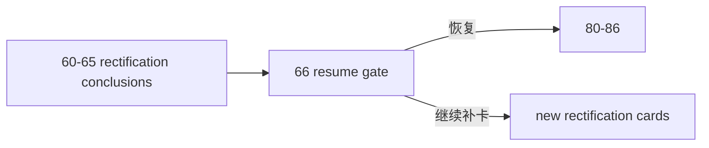

# mainline rectification resume gate card

`卡号`：`66`
`日期`：`2026-04-15`
`状态`：`已完成`

## 需求

- 问题：`60-65` 已分别裁清主线整改的 scope、coverage、boundary、`wave_life` 真值与 `formal signal` admission authority，但系统仍缺少一张正式 gate 卡来判断这些整改是否已经足以恢复 `80-86`。
- 目标结果：正式冻结“`80-86` 是否恢复、按原顺序恢复还是继续补卡”的系统级裁决，并把该裁决写回执行索引、路线图与入口文件。
- 为什么现在做：`65` 已把 `alpha formal signal` 的 final admission authority 正式收回，`60-65` 的整改闭环已经具备被统一复核的前提；若不立即进入 `66`，仓库会再次陷入“到底能不能恢复 `80-86`”的口头状态。

## 设计输入

- `docs/01-design/α-system-roadmap-and-progress-tracker-charter-20260409.md`
- `docs/01-design/01-doc-first-development-governance-20260409.md`
- `docs/02-spec/Ω-system-delivery-roadmap-20260409.md`
- `docs/03-execution/59-mainline-middle-ledger-2010-truthfulness-gate-conclusion-20260414.md`
- `docs/03-execution/60-mainline-rectification-batch-registration-and-scope-freeze-conclusion-20260415.md`
- `docs/03-execution/61-structure-filter-tail-coverage-truthfulness-rectification-conclusion-20260415.md`
- `docs/03-execution/62-filter-pre-trigger-boundary-and-authority-reset-conclusion-20260415.md`
- `docs/03-execution/63-wave-life-official-ledger-truthfulness-and-bootstrap-conclusion-20260415.md`
- `docs/03-execution/64-alpha-stage-percentile-decision-matrix-integration-conclusion-20260415.md`
- `docs/03-execution/65-formal-signal-admission-boundary-reallocation-conclusion-20260415.md`

## 任务分解

1. 汇总 `60-65` 的正式裁决、残留项与仍未闭合的真实阻断。
2. 判定 `80-86` 是否可恢复、是否需要改写、还是必须继续追加整改卡。
3. 回填 `66` evidence / record / conclusion，并同步执行索引、路线图与当前待施工卡。

## 实现边界

- 本卡只负责恢复闸门裁决，不直接实现 `80-86` 内容。
- 本卡不绕过 `60-65` 已接受的逐卡结论。
- 本卡保持 `100-105` 仍只能位于 `86` 之后。

## 历史账本约束

- 实体锚点：执行卡 `card_no`
- 业务自然键：`card_no + gate_version`
- 批量建仓：一次性汇总 `60-65` 结论并冻结恢复顺序
- 增量更新：每新增一张整改结论后可重开 `66` 复核
- 断点续跑：以执行索引和 gate 结论续接，不跳卡
- 审计账本：`66-* evidence / record / conclusion` 与执行索引回填

## 收口标准

1. `60-65` 已形成可审计整改结论集。
2. `80-86` 的恢复条件已有正式 gate 裁决。
3. 执行目录、路线图与入口文件已同步到恢复裁决。

## 卡片结构图

