# mainline rectification resume gate 结论
`结论编号`：`66`
`日期`：`2026-04-15`
`状态`：`已完成`

## 裁决

- 接受：`60-65` 已形成完整、可审计且无需继续追加前置整改卡的主线整改结论集。
- 接受：`78-84` 现在正式恢复为当前 active 的 official middle-ledger resume 卡组；当前待施工卡前移到 `78-malf-alpha-dual-axis-refactor-scope-freeze-card-20260418.md`。
- 接受：`78-84` 必须继承 `59` 的 truthfulness template，并叠加 `61-65` 收紧后的正式执行边界：
  - `structure / filter` 历史窗口必须显式 bounded full-window
  - `checkpoint queue` 只允许显式声明后作为增量续跑入口
  - `wave_life` 首跑必须显式 bounded bootstrap
  - `stage × percentile` 只允许在 `alpha formal signal` 融合
  - final admission authority 只属于 `alpha formal signal`
- 接受：`100-105` 继续保持冻结，只有 `96` 接受后才允许恢复。
- 拒绝：把 `66` 解读为 `78-84` 已自动通过、`96` 已提前成立，或 `trade / system` 可以直接恢复。
- 拒绝：在 `66` 之后继续把 `filter`、隐式 queue 首跑或 `wave_life` explanation-only 口径带回 `78-84`。

## 原因

### 1. `60` 已经把整改问题登记成正式主线批次，`66` 现在只剩“是否恢复”的裁决问题

`60` 已明确：

1. `60 -> 66` 是 `59` 之后、`78 -> 84` 之前的唯一整改卡组
2. `78-84` 只能在整改收口后恢复
3. `100-105` 仍必须继续后置

因此 `66` 不需要再次讨论批次身份，而是要判断该批次是否已经收口完成。

### 2. `61-65` 已把 `59` 暴露的真实缺口逐层关闭

`59` 后仍需修正的不是 `2010` pilot template 本身，而是 template 落地前的几个关键边界：

1. `61` 关闭了 `structure / filter` 历史窗口默认入 queue 的错误路径
2. `62` 把 `filter` 正式拉回 pre-trigger 边界
3. `63` 证明 `wave_life` 官方 truth 已建立，且首跑/续跑入口区分清楚
4. `64` 把 `stage × percentile` 的正式解释层冻结在 `alpha formal signal`
5. `65` 把 final admission authority 正式收回到 `alpha formal signal`

这些问题现在都已有 accepted conclusion，不再是未决整改项。

### 3. 剩余工作已经属于恢复卡组自身，而不再属于整改前置条件

`66` 复核后仍未完成的事项是：

1. `90-95` 分窗 official middle-ledger 建库
2. `84` official cutover gate
3. `100-105` trade / system 恢复

这说明系统已经离开“要不要继续整改”的阶段，进入“按恢复模板正式执行”的阶段。

## 影响

1. 当前最新生效结论锚点推进到 `66-mainline-rectification-resume-gate-conclusion-20260415.md`。
2. 当前待施工卡推进到 `78-malf-alpha-dual-axis-refactor-scope-freeze-card-20260418.md`。
3. `60-66` 现在被正式视为已完成整改卡组；主线后续顺序固定为：
   - `78 -> 79 -> 80 -> 81 -> 82 -> 83 -> 84`
   - `100 -> 101 -> 102 -> 103 -> 104 -> 105`
4. `Ω` 路线图、执行索引与入口文件必须统一服从 `66 -> 78 -> 84 -> 100` 的新口径。
5. 后续若 `78-84` 执行中再暴露新缺口，必须登记到所属恢复卡或后置卡，不得反向抹平 `66` 已成立的 resume gate。

## 六条历史账本约束检查

| 项目 | 当前状态 | 说明 |
| --- | --- | --- |
| 实体锚点 | 已满足 | `66` 继续以执行卡 `card_no` 为 gate 实体锚点 |
| 业务自然键 | 已满足 | `card_no + gate_version` 继续作为 resume gate 的自然键 |
| 批量建仓 | 已满足 | `60-65` 已一次性汇总并冻结为恢复前的整改结论集 |
| 增量更新 | 已满足 | 后续若新增整改卡，必须显式重开新的 gate；当前 `66` 不再阻断 `78-84` |
| 断点续跑 | 已满足 | 执行索引、路线图与最新结论锚点已统一续接到 `90` |
| 审计账本 | 已满足 | `66` 的 `card / evidence / record / conclusion` 与索引更新已形成正式审计闭环 |

## 结论结构图

```mermaid
flowchart LR
    C60["60 批次登记"] --> C61["61 bounded/queue 防呆"]
    C61 --> C62["62 filter pre-trigger boundary"]
    C62 --> C63["63 wave_life official truth"]
    C63 --> C64["64 stage-percentile matrix"]
    C64 --> C65["65 alpha-owned admission authority"]
    C65 --> G66["66 resume gate passed"]
    G66 --> C80["78-84 official middle-ledger resume"]
    C80 --> C86["86 cutover gate"]
    C86 --> C100["100-105 trade/system reopen"]
```

