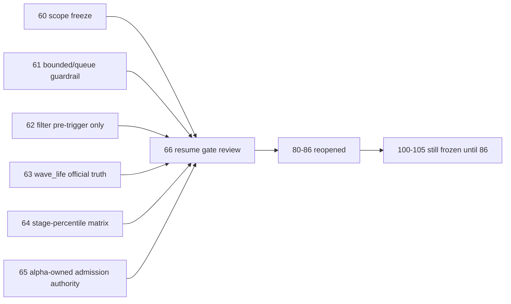

# mainline rectification resume gate 证据
`证据编号`：`66`
`日期`：`2026-04-15`

## 校验命令

1. `python scripts/system/check_doc_first_gating_governance.py`
   - 结果：通过
   - 说明：当前待施工卡已切到 `80-mainline-middle-ledger-2011-2013-bootstrap-card-20260414.md`，其需求、设计、规格、任务分解与历史账本约束已齐备。
2. `python .codex/skills/lifespan-execution-discipline/scripts/check_execution_indexes.py --include-untracked`
   - 结果：通过
   - 说明：`66` 的 `card / evidence / record / conclusion` 已补齐，执行索引、阅读顺序与完成账本对 `66 -> 80` 的切换一致。
3. `python scripts/system/check_development_governance.py`
   - 结果：未全绿，但未发现本卡新增违规
   - 说明：剩余失败仅为历史 file-length 债务：
     - `src/mlq/data/data_mainline_incremental_sync.py`（1013 行）
     - `src/mlq/portfolio_plan/runner.py`（1705 行）
     - 以及若干超过 800 行目标上限但未超过硬上限的历史文件

## resume gate 对账表

| gate 项 | 来源结论 | `66` 复核结果 | 对 `80-86` 的影响 |
| --- | --- | --- | --- |
| 整改批次与顺序冻结 | `60` | 已满足 | `80-86` 可作为整改后的唯一恢复卡组恢复，不再与 `60-66` 混排 |
| `structure / filter` 历史窗口覆盖口径 | `61` | 已满足 | 正式脚本入口已强制显式选择 `bounded full-window` 或 `checkpoint queue`，`80-86` 不会再静默无参入 queue |
| `filter` pre-trigger 边界 | `62` | 已满足 | `filter` 不再越界输出结构性最终 verdict，`80-86` 的 downstream 责任边界稳定 |
| `wave_life` 官方真值与 bootstrap 口径 | `63` | 已满足 | `wave_life` 已具备真实官方样本，且首跑/续跑入口已区分为显式 bounded 与显式 queue |
| `stage × percentile` 正式接入层 | `64` | 已满足 | `wave_life` 只读 sidecar 的正式解释层已冻结在 `alpha formal signal` |
| final admission authority | `65` | 已满足 | `alpha formal signal v5` 已正式取得 admission authority，`position` 改为消费 alpha-owned verdict |

## 索引与入口事实

1. `README.md / AGENTS.md / pyproject.toml` 已统一刷新为：
   - 最新生效结论锚点：`66-mainline-rectification-resume-gate-conclusion-20260415.md`
   - 当前待施工卡：`80-mainline-middle-ledger-2011-2013-bootstrap-card-20260414.md`
2. `docs/03-execution/00 / A / B / C` 已统一表达：
   - `60-66` 为已完成整改卡组
   - `80-86` 为当前 active 的 official middle-ledger resume 卡组
   - `100-105` 仍只能位于 `86` 之后
3. `docs/02-spec/Ω-system-delivery-roadmap-20260409.md` 已不再把 `alpha` 信号锚点或 `position / portfolio_plan` data-grade 语义记为当前整改阻塞，而是把系统焦点前移到 `80-86 -> 100-105`。

## 证据要点

1. `60-65` 已形成一组完整、连续且互不越权的整改结论集，覆盖：
   - scope freeze
   - bounded full-window / queue 显式入口
   - filter pre-trigger boundary
   - `wave_life` official truth
   - `stage_percentile` decision matrix
   - alpha-owned admission authority
2. `66` 复核后未发现仍必须留在整改批次内的新阻断项；剩余工作已全部属于：
   - `80-86` 的 official middle-ledger 恢复与 cutover
   - `100-105` 的 trade / system 恢复卡组
3. `66` 放行的是“恢复 `80-86` 的施工权限”，不是“`80-86` 已自动通过”或“`86` 已提前成立”。

## 证据结构图

