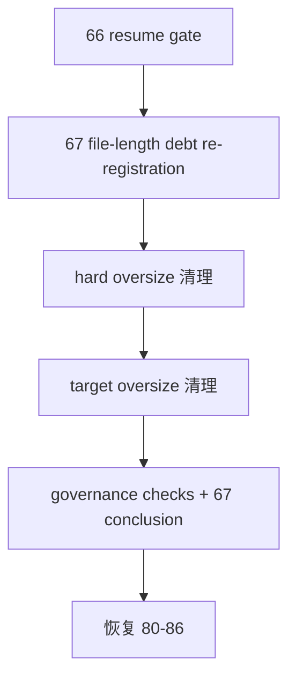

# historical file-length debt burndown

卡片编号：`67`
日期：`2026-04-15`
状态：`已完成`

## 需求

- 问题：
  `66` 收口后的全仓 `python scripts/system/check_development_governance.py` 再次显式暴露 `2` 项 hard oversize 与 `3` 项 target oversize file-length 债务，而当前 `37` 结论、入口文件与 `development_governance_legacy_backlog.py` 仍停留在“backlog 已清零”的旧口径，正式治理账本已经与真实扫描结果失配。
- 目标结果：
  新开 `67` 作为历史 file-length 债务重登记与清理卡，先把当前债务重新登记为正式 backlog，再按正式治理边界完成拆分/收敛，并在 `67` 收口后恢复 `80-86`。
- 为什么现在做：
  如果继续沿用 `66 -> 80` 的口头路径直接推进，仓库会同时存在“治理台账为零”和“治理扫描显式报债”两套正式事实，后续 `80-86` 的执行证据将失去治理可信度。

## 设计输入

- `docs/01-design/01-doc-first-development-governance-20260409.md`
- `docs/01-design/modules/system/11-governance-historical-debt-backlog-burndown-charter-20260412.md`
- `docs/02-spec/01-doc-first-task-gating-spec-20260409.md`
- `docs/02-spec/modules/system/11-governance-historical-debt-backlog-burndown-spec-20260412.md`
- `docs/03-execution/37-system-governance-historical-debt-backlog-burndown-conclusion-20260412.md`
- `docs/03-execution/66-mainline-rectification-resume-gate-conclusion-20260415.md`

## 当前债务基线

1. hard oversize
   - `src/mlq/data/data_mainline_incremental_sync.py`（`1013` 行）
   - `src/mlq/portfolio_plan/runner.py`（`1705` 行）
2. target oversize
   - `src/mlq/data/data_market_base_materialization.py`（`829` 行）
   - `src/mlq/data/data_tdxquant.py`（`867` 行）
   - `tests/unit/data/test_market_base_runner.py`（`852` 行）

## 任务分解

1. 重新登记当前 file-length 债务：
   - 更新 `scripts/system/development_governance_legacy_backlog.py`
   - 同步执行索引、路线图与入口文件，把当前施工位正式切到 `67`
2. 处理 hard oversize 债务：
   - 优先拆分或收敛 `src/mlq/data/data_mainline_incremental_sync.py`
   - 优先拆分或收敛 `src/mlq/portfolio_plan/runner.py`
3. 处理 target oversize 债务并回填闭环：
   - 收敛 `data_market_base_materialization.py / data_tdxquant.py / test_market_base_runner.py`
   - 跑治理检查与必要单测
   - 回填 `67` evidence / record / conclusion，并在收口后恢复 `80`

## 实现边界

- 范围内：
  - `docs/03-execution/67-*`
  - `scripts/system/development_governance_legacy_backlog.py`
  - 执行索引、路线图与入口文件中关于当前施工位和历史 backlog 的正式口径
  - 当前 `5` 项 file-length 债务文件与其必要 helper/test 拆分
- 范围外：
  - `80-86` official middle-ledger 的业务逻辑
  - `100-105` trade/system 恢复目标改写
  - 通过新增长期白名单绕过 file-length 债务

## 历史账本约束

- 实体锚点：
  `debt_type + path`
- 业务自然键：
  每项治理债务以 `debt_type + path` 唯一标识；`hard / target` 分类与文件路径共同定义 backlog 主语义。
- 批量建仓：
  以 `2026-04-15` 的全仓治理扫描结果为基线，一次性重登记当前 `5` 项 file-length 债务。
- 增量更新：
  每解决一项债务，只允许按自然键从 backlog 移除，并同步更新 `67` evidence / record / conclusion。
- 断点续跑：
  允许按 backlog 当前剩余项与 `67` 任务分解继续推进，不得重新把已移除债务写回“已清零”口径。
- 审计账本：
  `scripts/system/development_governance_legacy_backlog.py` 与 `67` 的 card / evidence / record / conclusion。

## 收口标准

1. `LEGACY_HARD_OVERSIZE_BACKLOG` 清零。
2. `LEGACY_TARGET_OVERSIZE_BACKLOG` 清零。
3. `python scripts/system/check_development_governance.py` 不再报告 file-length 历史债务。
4. `67` evidence / record / conclusion 回填完成，当前施工位恢复到 `80`。

## 卡片结构图

