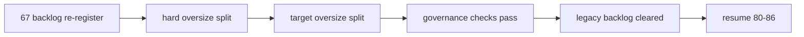

# historical file-length debt burndown 证据
`证据编号`：`67`
`日期`：`2026-04-15`

## 校验命令

1. `python scripts/system/check_doc_first_gating_governance.py`
   - 结果：通过
   - 说明：`67` 卡在施工与收口阶段均保持 doc-first gating 合规。
2. `python .codex/skills/lifespan-execution-discipline/scripts/check_execution_indexes.py --include-untracked`
   - 结果：通过
   - 说明：`67` 的 `card / evidence / record / conclusion` 与执行索引、入口文件已对齐。
3. `python scripts/system/check_development_governance.py`
   - 结果：通过
   - 说明：全仓 file-length 历史债务已清零，`development_governance_legacy_backlog.py` 不再保留 hard / target oversize 白名单。
4. `python -m pytest tests/unit/data/test_mainline_incremental_sync.py -q --basetemp H:\Lifespan-temp\pytest-tmp\67-data-mainline`
   - 结果：`3 passed`
   - 说明：`data_mainline_incremental_sync.py` helper 拆分后行为保持稳定。
5. `python -m pytest tests/unit/portfolio_plan/test_runner.py -q --basetemp H:\Lifespan-temp\pytest-tmp\67-portfolio-plan`
   - 结果：`4 passed`
   - 说明：`portfolio_plan/runner.py` 拆分后主流程与 queue/checkpoint 契约未变。
6. `python -m pytest tests/unit/data/test_market_base_runner.py -q --basetemp H:\Lifespan-temp\pytest-tmp\67-market-base`
   - 结果：`8 passed`
   - 说明：`data_market_base_materialization.py`、`data_tdxquant.py` 与 `test_market_base_runner.py` 的辅助拆分保持原有 raw/base/tdxquant 桥接行为。

## 清债结果

1. hard oversize 清零：
   - `src/mlq/data/data_mainline_incremental_sync.py`：`1013 -> 737`
   - `src/mlq/portfolio_plan/runner.py`：`1705 -> 771`
2. target oversize 清零：
   - `src/mlq/data/data_market_base_materialization.py`：`829 -> 581`
   - `src/mlq/data/data_tdxquant.py`：`867 -> 516`
   - `tests/unit/data/test_market_base_runner.py`：`852 -> 749`
3. 新增 helper / support 拆分文件均未超过 800 行，并保持对外脚本入口与表族契约不变。

## 证据要点

1. `portfolio_plan` 拆分为 `runner.py + runner_shared.py + runner_source.py + runner_queue.py + runner_reporting.py`，保留原脚本入口与 v2 ledger 契约。
2. `mainline incremental sync` 拆分为 `data_mainline_incremental_sync.py + data_mainline_sync_support.py`，控制面 helper 与主流程骨架分离。
3. `market_base` 审计/dirty queue helper 拆到 `data_market_base_governance.py`，测试支撑 helper 拆到 `tests/unit/data/market_base_test_support.py`。
4. `tdxquant` 的 request/checkpoint/run audit helper 拆到 `data_tdxquant_support.py`，保留 `run_tdxquant_daily_raw_sync` 官方入口语义。

## 证据结构图

