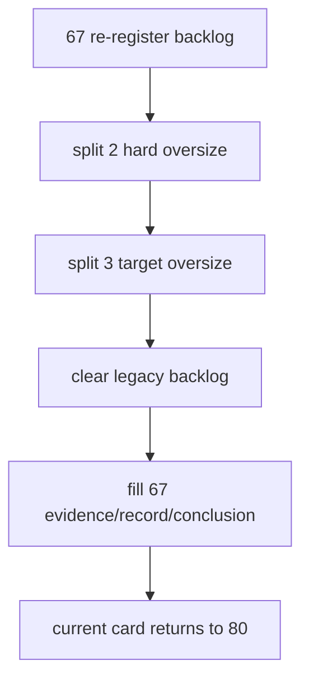

# historical file-length debt burndown 记录
`记录编号`：`67`
`日期`：`2026-04-15`

## 执行过程概述

`67` 先把 `66` 之后重新暴露的 `2` 项 hard oversize 与 `3` 项 target oversize 正式登记回 backlog，再按模块职责把超长文件拆到 helper / support sidecar，最后同步回收历史白名单、补齐执行闭环并把当前施工位恢复到 `80`。

## 关键记录

1. `data_mainline_incremental_sync.py` 拆出 `data_mainline_sync_support.py`，把 source-state / checkpoint / report 控制面逻辑与同步主流程解耦。
2. `portfolio_plan/runner.py` 依次拆出 `runner_shared.py`、`runner_source.py`、`runner_queue.py`、`runner_reporting.py`，把 bridge 读取、queue/checkpoint、run-state/report 分层。
3. `data_market_base_materialization.py` 拆出 `data_market_base_governance.py`，集中承接 build run audit 与 dirty queue consumed 回写。
4. `tests/unit/data/test_market_base_runner.py` 拆出 `market_base_test_support.py`，把临时仓、TDX 文本写入和 fake client 共享化。
5. `data_tdxquant.py` 拆出 `data_tdxquant_support.py`，把 request NK、response digest、checkpoint、request audit 与 run audit 收敛到 sidecar。
6. `scripts/system/development_governance_legacy_backlog.py` 最终回到空 backlog，证明 `67` 已把本轮 file-length 历史债务全部闭环。

## 变更清单

| 类型 | 路径 | 说明 |
| --- | --- | --- |
| 更新代码 | `src/mlq/data/data_mainline_incremental_sync.py` | 主流程瘦身并改为消费 sync support |
| 新增 helper | `src/mlq/data/data_mainline_sync_support.py` | source-state / checkpoint / report 辅助 |
| 更新代码 | `src/mlq/portfolio_plan/runner.py` | 主流程压缩至目标线内 |
| 新增 helper | `src/mlq/portfolio_plan/runner_shared.py`、`runner_source.py`、`runner_queue.py`、`runner_reporting.py` | 常量、桥接读取、queue/checkpoint、run-state/report sidecar |
| 更新代码 | `src/mlq/data/data_market_base_materialization.py` | 抽离 run audit / dirty queue helper |
| 新增 helper | `src/mlq/data/data_market_base_governance.py` | market_base build governance sidecar |
| 更新代码 | `src/mlq/data/data_tdxquant.py` | 抽离 request/checkpoint/run audit helper |
| 新增 helper | `src/mlq/data/data_tdxquant_support.py` | tdxquant audit / checkpoint sidecar |
| 更新测试 | `tests/unit/data/test_market_base_runner.py` | 共享 helper 后回落到目标线内 |
| 新增测试 helper | `tests/unit/data/market_base_test_support.py` | 公共测试支撑 |
| 更新治理 | `scripts/system/development_governance_legacy_backlog.py` | hard / target backlog 清零 |
| 更新文档 | `docs/03-execution/67-*`、`00/A/B/C`、`Ω`、`README.md`、`AGENTS.md`、`pyproject.toml` | `67` 收口并恢复 `80` |

## 收口判断

`67` 的完成标准不是“局部文件低于硬上限”，而是“历史 file-length backlog 与治理扫描结果重新一致，且当前主线可在无白名单债务的前提下恢复 `80-86`”。本次执行后：

1. `check_development_governance.py` 不再报告任何 file-length 历史债务。
2. `67` 对应的 `card / evidence / record / conclusion` 已补齐。
3. 执行索引、路线图与入口文件已统一恢复到 `67 -> 80 -> 86 -> 100` 的正式口径。

## 记录结构图

