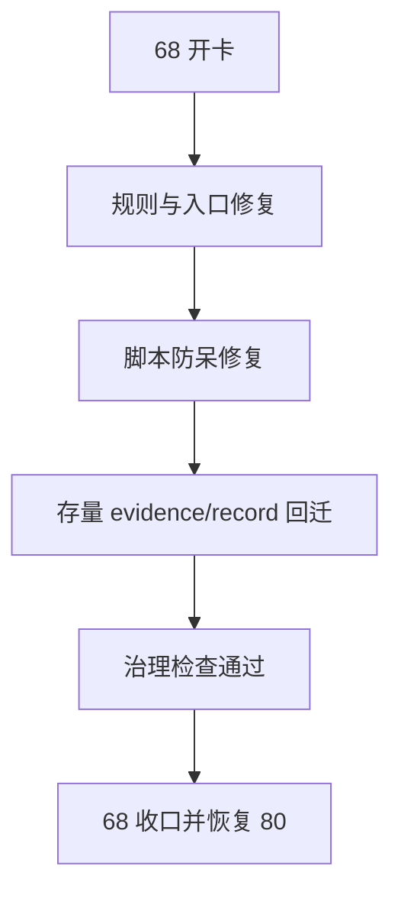

# 执行文档目录治理回迁与固化
卡片编号：`68`
日期：`2026-04-15`
状态：`已完成`

## 需求
- 问题：
  `docs/03-execution/README.md` 明确声明 `evidence/` 与 `records/` 是正式目录，但从 `38` 之后，多张卡的 `evidence / record` 被直接放回 `docs/03-execution/` 根目录，导致正式文档布局与现行规则失配；同时 `new_execution_bundle.py` 与 `check_execution_indexes.py` 没有把这种失配拦住，文档治理入口已经漂移。
- 目标结果：
  恢复 `docs/03-execution/` 的正式目录纪律：根目录只保留 `card / conclusion / index / template / README`，`evidence` 全部进入 `docs/03-execution/evidence/`，`record` 全部进入 `docs/03-execution/records/`；并把该约束固化到规则、入口和治理脚本中，避免再次遗忘。
- 为什么现在做：
  如果继续在错误目录结构上推进 `78-84`，后续执行闭环虽然表面存在，实际已经脱离仓库自有文档纪律；越晚修复，回迁成本和索引漂移只会更大。

## 设计输入

- `docs/README.md`
- `docs/02-spec/00-repo-layout-and-docflow-spec-20260409.md`
- `docs/03-execution/README.md`
- `docs/01-design/01-doc-first-development-governance-20260409.md`
- `docs/02-spec/01-doc-first-task-gating-spec-20260409.md`
- `docs/03-execution/67-historical-file-length-debt-burndown-conclusion-20260415.md`

## 任务分解

1. 开卡并冻结文档治理边界：
   - 把当前施工位切到 `68`
   - 明确 `03-execution` 的正式目录分工和回迁范围
2. 修复治理入口与规则：
   - 更新 `docs/README.md / docs/02-spec/00-repo-layout-and-docflow-spec-20260409.md / docs/03-execution/README.md`
   - 更新 `README.md / AGENTS.md / pyproject.toml` 中涉及文档布局的入口口径
   - 修复 `.codex/skills/lifespan-execution-discipline/scripts/new_execution_bundle.py`
   - 强化 `.codex/skills/lifespan-execution-discipline/scripts/check_execution_indexes.py`
3. 回迁存量执行文档并收口：
   - 把根目录错放的 `*-evidence-*` / `*-record-*` 回迁到正式子目录
   - 同步 evidence catalog / records 链 / 执行索引
   - 跑治理检查并回填 `68` evidence / record / conclusion，收口后恢复 `90`

## 实现边界

- 范围内：
  - `docs/README.md`
  - `docs/02-spec/00-repo-layout-and-docflow-spec-20260409.md`
  - `docs/03-execution/README.md`
  - `docs/03-execution/00-conclusion-catalog-20260409.md`
  - `docs/03-execution/evidence/00-evidence-catalog-20260409.md`
  - `docs/03-execution/A-execution-reading-order-20260409.md`
  - `docs/03-execution/B-card-catalog-20260409.md`
  - `docs/03-execution/C-system-completion-ledger-20260409.md`
  - `docs/03-execution/68-*`
  - `README.md / AGENTS.md / pyproject.toml`
  - `.codex/skills/lifespan-execution-discipline/scripts/new_execution_bundle.py`
  - `.codex/skills/lifespan-execution-discipline/scripts/check_execution_indexes.py`
  - 根目录中错放的 `38-67` evidence / record 文档
- 范围外：
  - `78-84` official middle-ledger 业务逻辑
  - `src/` 下正式业务代码
  - 新增与本次目录治理无关的文档体系分层改造

## 历史账本约束

- 实体锚点：
  `doc_kind + card_no + slug`
- 业务自然键：
  执行闭环文档以 `card_no + slug + doc_kind` 唯一标识，且 `doc_kind in {card, evidence, record, conclusion}` 与目录位置共同定义正式身份。
- 批量建仓：
  对当前根目录错放的执行文档做一次性回迁建账，恢复 `execution root / evidence / records` 的正式目录边界。
- 增量更新：
  后续新增执行文档必须通过规则和脚本自动落到正确目录，不允许再手工绕开正式入口。
- 断点续跑：
  允许按 `68` 的任务分解分步治理，但每完成一批回迁都必须保持索引和脚本可继续运行。
- 审计账本：
  `68` 的 `card / evidence / record / conclusion`，以及更新后的索引、规则文档与治理脚本。

## 收口标准

1. 根目录中不再残留错放的 `*-evidence-*` 与 `*-record-*` 正式文档
2. `new_execution_bundle.py` 能按当前规则正确生成并回填四件套
3. `check_execution_indexes.py` 能显式拦截 evidence/record 错放根目录
4. 文档规则与入口文件已明确写入“永不再忘”的目录纪律
5. `68` evidence / record / conclusion 补齐并在收口后恢复 `90`

## 卡片结构图

