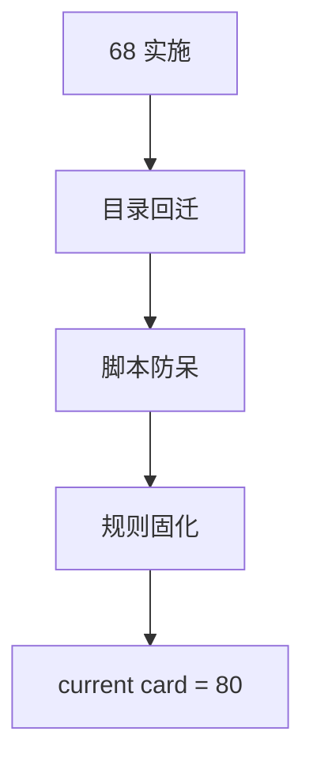

# 执行文档目录治理回迁与固化 结论

结论编号：`68`
日期：`2026-04-15`
状态：`已完成`

## 裁决

- 接受：`68` 已完成 `docs/03-execution/` 正式目录布局回迁，根目录重新只保留 `card / conclusion / index / template / README`。
- 接受：`38-67` 错放的 `24` 份 evidence 与 `24` 份 record 已全部回迁到正式子目录，`44` 的完整正式稿已覆盖子目录占位稿。
- 接受：执行文档 bundle 入口与 execution index checker 已补齐防呆，后续再出现根目录错放会被显式拦截。
- 接受：当前最新生效结论锚点推进到 `68-execution-doc-layout-governance-restoration-conclusion-20260415.md`，当前待施工卡恢复到 `80-mainline-middle-ledger-2011-2013-bootstrap-card-20260414.md`。

## 原因

1. 本次问题的根因不是“没有目录规则”，而是规则文本、生成脚本和检查脚本之间失配，导致人工落档可以长期绕开正式布局却不被治理发现。
2. 仅回迁文件而不补脚本，问题还会重复发生；仅补脚本而不回迁存量文档，正式账本又会继续保留两套目录现实。因此 `68` 必须同时完成规则固化、脚本防呆和存量回迁。
3. 三项治理检查已经同时通过，说明当前执行目录布局、索引回填、入口文件与待施工卡口径已经重新一致。

## 影响

1. 后续执行文档的正式布局固定为：
   - 根目录：`card / conclusion / index / template / README`
   - `docs/03-execution/evidence/`：正式 evidence
   - `docs/03-execution/records/`：正式 record
2. `68` 之后，任何把 `*-evidence-*` 或 `*-record-*` 放回根目录的行为都会被视为治理违规，并由 execution index checker 直接报错。
3. 当前主线恢复到 `80 -> 81 -> 82 -> 83 -> 84 -> 85 -> 86 -> 100 -> 101 -> 102 -> 103 -> 104 -> 105`。

## 六条历史账本约束检查
| 项目 | 当前状态 | 说明 |
| --- | --- | --- |
| 实体锚点 | 已满足 | 执行文档主语义固定为 `doc_kind + card_no + slug` |
| 业务自然键 | 已满足 | `card_no + slug + doc_kind + 目录位置` 已重新统一为唯一正式身份 |
| 批量建仓 | 已满足 | `38-67` 错放的 evidence / record 已一次性完成回迁 |
| 增量更新 | 已满足 | 后续新增四件套由 bundle 入口生成，并受 execution-layout 检查持续约束 |
| 断点续跑 | 已满足 | `68` 闭环允许后续按索引、目录和脚本审计链复核 |
| 审计账本 | 已满足 | `68` card / evidence / record / conclusion、索引、规则文档与治理脚本已同步刷新 |

## 结论结构图

