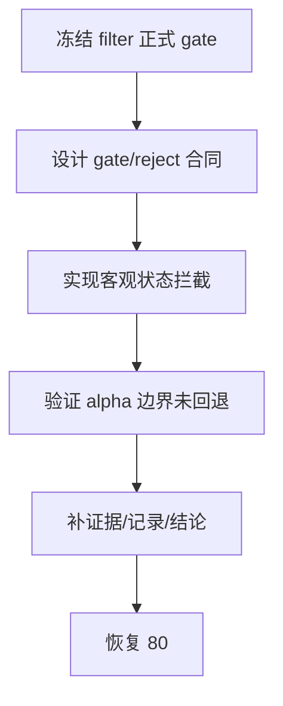

# filter 客观可交易性与标的宇宙 gate 冻结

卡片编号：`69`
日期：`2026-04-15`
状态：`待施工`

## 需求

- 问题：
  `62` 与 `65` 已把 `filter` 的正式边界收紧为 pre-trigger gate，把最终 blocked/admitted authority 收回到 `alpha formal signal`；但当前正式实现里 `blocking_conditions` 为空，`trigger_admissible` 实际恒等于 `true`。与此同时，停牌、`ST/*ST`、退市整理、证券类型不在正式宇宙等“客观上就不该进入后续流程”的状态还没有被正式冻结到 `filter`，导致 `filter` 既没有真正承担可交易性 gate，又缺少正式拒绝原因枚举。
- 目标结果：
  把 `filter` 的正式职责落实为“客观可交易性与标的宇宙 gate”：只允许它拦截停牌/未复牌、`ST/*ST` 或其他风险警示排除、退市整理、以及不在正式策略宇宙中的证券类型/市场类型；同时显式拒绝把主观风险、结构美观度、事件解释、`stage_percentile` 之类解释性判断塞回 `filter`。
- 为什么现在做：
  如果不先把 `filter` 的实际 gate 内容冻结，后续 `80-86` official middle-ledger 恢复时就会继续沿用“名义有 gate、实现不拦人”的空窗口径；这会让 `alpha`、`position` 和后续真实库 cutover 都建立在一个未冻结的 pre-trigger 输入层上。

## 设计输入

- 设计文档：
  - `docs/01-design/01-doc-first-development-governance-20260409.md`
  - `docs/01-design/modules/filter/00-filter-module-lessons-20260409.md`
  - `docs/01-design/modules/filter/01-filter-formal-snapshot-charter-20260409.md`
- 规格文档：
  - `docs/02-spec/01-doc-first-task-gating-spec-20260409.md`
  - `docs/02-spec/modules/filter/01-filter-formal-snapshot-spec-20260409.md`
  - `docs/02-spec/Ω-system-delivery-roadmap-20260409.md`
- 已生效结论：
  - `docs/03-execution/62-filter-pre-trigger-boundary-and-authority-reset-conclusion-20260415.md`
  - `docs/03-execution/65-formal-signal-admission-boundary-reallocation-conclusion-20260415.md`
- 官方规则输入：
  - 上交所《上市公司自律监管指引第 4 号 停复牌》2025-03-28 修订版
  - 深交所投资者问答关于 `ST/*ST` 风险警示说明
  - 证监会 2024-06-06 关于上市公司 `ST/*ST` 制度答记者问

## 任务分解

1. 冻结 `filter` 允许承担的正式 gate 范围：
   - 明确客观可交易性与标的宇宙边界
   - 明确 `filter` 不得处理的主观解释类事项
2. 设计正式 gate/reject reason 合同：
   - 给出 `filter_gate_code / filter_reject_reason_code` 枚举
   - 明确与 `trigger_admissible`、`formal_signal_status`、`admission_reason_code` 的边界
3. 落实现有 `filter` runner/materialization：
   - 接入停牌、风险警示、退市整理、证券类型/市场类型等客观状态
   - 保持 `62/65` 已冻结的 authority 边界不被破坏
4. 回填验证与收口：
   - 单测、命令证据、记录、结论
   - 同步 `A/B/C`、`README.md`、`AGENTS.md`、`pyproject.toml`、`Ω`

## 实现边界

- 范围内：
  - `src/mlq/filter/*`
  - `src/mlq/alpha/*` 中与 `filter_gate_code / filter_reject_reason_code` 对接的正式合同
  - `tests/unit/filter/*`
  - `tests/unit/alpha/*` 中与 filter gate 相关的回归
  - `docs/03-execution/69-*`
  - `docs/03-execution/A/B/C`
  - `README.md`
  - `AGENTS.md`
  - `pyproject.toml`
  - `docs/02-spec/Ω-system-delivery-roadmap-20260409.md`
- 范围外：
  - `alpha` 对主观风险、结构质量、事件解释、`stage_percentile` 的最终 admission authority
  - `position / trade / system` 逻辑
  - 真实正式库 `80-86` middle-ledger 建库实现本身

## 历史账本约束

- 实体锚点：
  `asset_type + code + signal_date`
- 业务自然键：
  `instrument + signal_date + filter_contract_version`
- 批量建仓：
  bounded window 可按正式 gate 规则重物化 `filter_snapshot`
- 增量更新：
  checkpoint / queue 续跑时按 `signal_date` 增量接入客观状态，并在 gate 指纹变化时触发 rematerialize
- 断点续跑：
  `filter_work_queue / filter_checkpoint` 继续承担 replay / resume，不把 `run_id` 写成业务真值
- 审计账本：
  `filter_run / filter_snapshot / filter_run_snapshot`，以及 `69` 的 card / evidence / record / conclusion

## 收口标准

1. `filter` 的正式 gate 范围与非范围已经写成正式文档
2. `trigger_admissible=false` 只由客观可交易性/宇宙排除类状态触发
3. `filter_gate_code / filter_reject_reason_code` 正式落地，并与 `alpha formal signal` 边界对齐
4. 单测、证据、记录、结论补齐
5. 入口文件与路线图已同步到 `68 -> 69 -> 80`

## 卡片结构图

