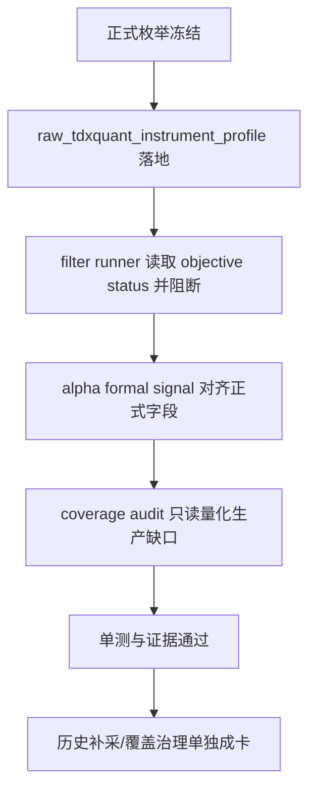

# filter 客观可交易性与标的宇宙 gate 冻结 结论

结论编号：`69`
日期：`2026-04-15`
状态：`草稿`

## 裁决

- 接受 `69` 的当前实现收口：`filter` 已正式接入真实 objective status 来源，并把客观可交易性与标的宇宙 gate 冻结为正式上游合同。
- 接受把历史覆盖问题拆出 `69` 主体：`2026-04-15` 的只读 coverage audit 已证明官方生产库当前 `filter_snapshot` 全量 `6835` 行都处于 `objective_status=missing`，且 `raw_market.raw_tdxquant_instrument_profile` 尚未正式出现在生产 raw DB；这属于独立的数据回补/覆盖治理卡，不再与 `69` 的合同冻结和正式接线混在一起。

## 原因

- `65` 已把 `filter_gate_code / filter_reject_reason_code` 冻结为 `alpha formal signal` 必须保留的上游审计事实；本轮继续把真实 objective source 一并接上，避免后续 official middle-ledger 恢复继续依赖临时推导。
- `run_tdxquant_daily_raw_sync(...)` 现在会把 `get_stock_info(...)` 的客观状态沉淀进 `raw_market.raw_tdxquant_instrument_profile`，`run_filter_snapshot_build(...)` 读取该官方侧账本并映射五类 reject reason，完成了 `69` 卡要求的真实输入接线。
- 只读 coverage audit 已把缺口从“存在历史覆盖不确定性”量化为“官方生产库当前 100% missing，且最小补采窗口覆盖 `2010-01-04 -> 2026-04-08`”，因此应该独立成卡治理。

## 影响

- `raw_market` 新增 `raw_tdxquant_instrument_profile`，正式沉淀 `market_type / security_type / suspension_status / risk_warning_status / delisting_status` 及对应布尔 objective gate 字段。
- `filter_snapshot / filter_run_snapshot` 现在正式携带 `filter_gate_code / filter_reject_reason_code`，同时保留 `primary_blocking_condition / blocking_conditions_json` 作为 legacy 镜像；当 objective profile 存在时，`trigger_admissible=false` 会真实落地。
- `alpha formal signal` 现在优先读取正式 gate/reject 字段；历史库若缺列，仍可回退到 `trigger_admissible + primary_blocking_condition`。
- `scripts/filter/run_filter_objective_coverage_audit.py` 已作为只读治理脚本落地，可稳定量化 `filter_snapshot` 的 objective coverage missing，并给出最小补采窗口建议。
- 后续事项已被量化并明确拆分：生产库当前需要补采的最小窗口是 `2010-01-04 -> 2026-04-08`，不再是模糊的“可能缺一点历史 profile”。

## 结论结构图

