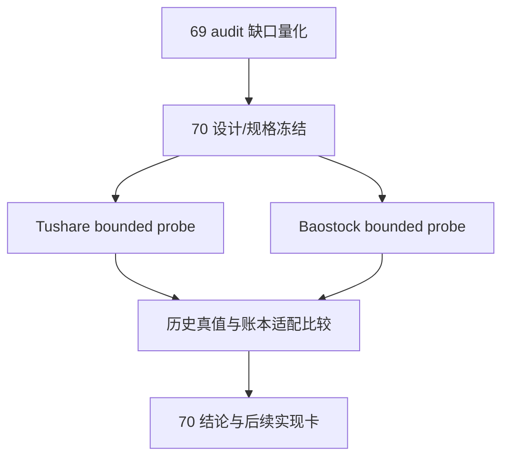

# 历史 objective profile 回补源选型与治理

`卡片编号：70`
`日期：2026-04-15`
`状态：草稿`

## 需求

- 问题：
  `69` 已经完成 objective gate 冻结与 coverage audit 接线，但真实官方库审计已经证明 `filter_snapshot` 的 `6835` 行在 `2010-01-04 -> 2026-04-08` 窗口内仍是 `100% missing`，当前缺口已经变成独立的历史 objective profile 回补问题。
- 目标结果：
  起一张正式选型与治理卡，冻结 `Tushare / Baostock` 的 bounded probe 范围、比较标准、字段分层、账本落地候选形态，以及后续实现卡边界。
- 为什么现在做：
  如果不先裁清历史源与真值语义，就会把“当前状态快照”误写成“历史时点真值”，后续 `80-86` official middle-ledger 恢复会建立在错误 objective 上游之上。

## 设计输入

- 设计文档：
  - `docs/01-design/modules/data/07-historical-objective-profile-backfill-source-selection-and-governance-charter-20260415.md`
  - `docs/01-design/modules/data/04-tdxquant-daily-raw-source-ledger-bridge-charter-20260410.md`
  - `docs/01-design/modules/filter/01-filter-formal-snapshot-charter-20260409.md`
- 规格文档：
  - `docs/02-spec/modules/data/07-historical-objective-profile-backfill-source-selection-and-governance-spec-20260415.md`
  - `docs/02-spec/modules/filter/01-filter-formal-snapshot-spec-20260409.md`
  - `docs/02-spec/Ω-system-delivery-roadmap-20260409.md`
- 已生效结论：
  - `docs/03-execution/69-filter-objective-tradability-and-universe-gate-freeze-conclusion-20260415.md`

## 任务分解

1. 冻结 source-selection 比较框架
   - 明确 `Tushare / Baostock / TdxQuant` 的角色边界。
   - 明确 objective 字段的静态/时变分层。
2. 完成双源 bounded probe
   - `Tushare` 重点验证 `stock_basic / suspend_d / st` 的历史能力、权限与最小窗口覆盖。
   - `Baostock` 重点验证 `query_all_stock(day)`、`query_stock_basic(...)`、`query_history_k_data_plus(..., tradestatus, isST)` 的日级状态能力。
3. 输出正式裁决
   - 明确推荐主路径、辅助路径、拒绝项。
   - 明确后续实现卡是否走“事件账本 -> 日快照物化”。

## 实现边界

- 范围内：
  - `docs/01-design/modules/data/07-*`
  - `docs/02-spec/modules/data/07-*`
  - `docs/03-execution/70-*`
  - bounded probe 命令、文档证据、记录、结论
- 范围外：
  - 正式历史 backfill runner
  - 生产库写入
  - `filter / alpha / position / trade / system` 逻辑改写
  - 把任何外部接口直接变成在线运行时依赖

## 历史账本约束

- 实体锚点：
  候选 objective 历史账本默认锚定 `asset_type + code`。
- 业务自然键：
  候选事件或日快照自然键至少要包含 `asset_type + code + objective_dimension + effective_date/observed_trade_date`。
- 批量建仓：
  仅冻结 `2010-01-04 -> 2026-04-08` 最小缺口窗口的历史回补方案，不执行正式灌库。
- 增量更新：
  后续必须支持“历史补采”和“从当前向前日更”两种路径分离，不得混成一条无语义的重跑命令。
- 断点续跑：
  后续正式实现必须有 source/request/date 级 checkpoint 或 work queue；本卡只裁定要求，不实现 runner。
- 审计账本：
  本卡的审计闭环落在 `70` 的 design/spec/evidence/record/conclusion。

## 收口标准

1. `70` 的 design/spec 已补齐并与 execution card 对齐。
2. `Tushare / Baostock` 双源 bounded probe 证据完整。
3. 已书面裁定 `TdxQuant get_stock_info(...)` 能否承担历史回补真值。
4. evidence / record / conclusion 写完，并明确下一张实现卡边界。

## 卡片结构图

