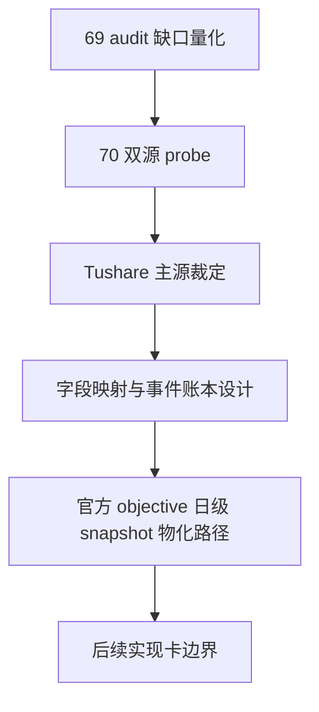

# 历史 objective profile 回补源选型与治理卡
`卡片编号：70`
`日期：2026-04-15`
`状态：草稿`

## 需求

- 问题：
  `69` 已经完成 objective gate 冻结与 coverage audit 接线，但真实官方库审计已经证明 `filter_snapshot` 的 `6835` 行在 `2010-01-04 -> 2026-04-08` 窗口内仍是 `100% missing`，当前缺口已经变成独立的历史 objective profile 回补问题。
- 目标结果：
  在 `70` 内先把 `Tushare` 主源候选的字段映射、账本表族、批量建仓、增量更新、checkpoint / replay 与下游物化路径冻结为正式文档口径，不先写 backfill runner。
- 为什么现在做：
  `Tushare / Baostock` 双源 probe 已经裁出主源/侧源分层；如果不继续把主源如何沉淀成正式历史账本裁清，后续实现卡仍会停留在“接口可用”层，无法进入可审计、可续跑、可复算的正式施工。

## 设计输入

- 设计文档：
  - `docs/01-design/modules/data/07-historical-objective-profile-backfill-source-selection-and-governance-charter-20260415.md`
  - `docs/01-design/modules/data/04-tdxquant-daily-raw-source-ledger-bridge-charter-20260410.md`
  - `docs/01-design/modules/filter/01-filter-formal-snapshot-charter-20260409.md`
- 规格文档：
  - `docs/02-spec/modules/data/07-historical-objective-profile-backfill-source-selection-and-governance-spec-20260415.md`
  - `docs/02-spec/modules/filter/01-filter-formal-snapshot-spec-20260409.md`
  - `docs/02-spec/Ω-system-delivery-roadmap-20260409.md`
- 已生效结论：
  - `docs/03-execution/69-filter-objective-tradability-and-universe-gate-freeze-conclusion-20260415.md`

## 任务分解

1. 冻结 source-selection 比较框架
   - 明确 `Tushare / Baostock / TdxQuant` 的角色边界。
   - 明确 objective 字段的静态 / 时变分层。
2. 完成双源 bounded probe
   - `Tushare` 验证 `stock_basic / suspend_d / stock_st / namechange` 的历史能力、权限与窗口覆盖。
   - `Baostock` 验证 `query_all_stock(day)`、`query_stock_basic(...)`、`query_history_k_data_plus(..., tradestatus, isST)` 的侧证能力。
3. 冻结主源字段映射与账本化设计
   - 将 `stock_basic` 映射为 universe / security_type / market_type / list_status / list_date / delist_date 主数据。
   - 将 `suspend_d` 映射为 `suspension_status` 事件源。
   - 将 `stock_st + namechange` 映射为 `risk_warning_status / delisting_arrangement` 的组合来源，并显式声明 `2010-2015` 的补齐假设。
   - 冻结 `Tushare 源事件账本 -> 官方 objective 日级 snapshot` 的两层落地形态。
4. 输出正式裁决
   - 明确推荐主路径、辅助路径、拒绝项。
   - 明确下一张实现卡的 runner / 表族 / 验证边界。

## 实现边界

- 范围内：
  - `docs/01-design/modules/data/07-*`
  - `docs/02-spec/modules/data/07-*`
  - `docs/03-execution/70-*`
  - bounded probe 报告引用、字段映射、账本表族、批量/增量/checkpoint 设计
- 范围外：
  - 正式历史 backfill runner
  - 生产库写入
  - `filter / alpha / position / trade / system` 逻辑改写
  - 把任何第三方接口直接变成在线运行时依赖

## 历史账本约束

- 实体锚点：历史 objective 账本默认锚定 `asset_type + code`。
- 业务自然键：源事件账本使用 `asset_type + code + source_name + source_api + objective_dimension + effective_start_date + source_record_hash`，日级快照使用 `asset_type + code + observed_trade_date`。
- 批量建仓：对 `2010-01-04 -> 2026-04-08` 执行一次性 bounded bootstrap；其中 `trade_date` 型接口按日期切片，`namechange` 按标的批量切片。
- 增量更新：`suspend_d / stock_st` 按交易日增量，`stock_basic` 按低频全量刷新或状态变更刷新，`namechange` 只对新标的、状态变化标的或审计发现不一致的标的执行定向重抓。
- 断点续跑：后续正式实现必须显式维护 `run / request / checkpoint`；checkpoint 至少覆盖 `source_api + cursor_type + cursor_value`，不允许把多接口全混成一条“重跑命令”。
- 审计账本：本卡审计闭环落在 `70` 的 `design/spec/evidence/record/conclusion`；后续实现卡必须补齐 `source run/request/checkpoint/event` 与日级 snapshot readout。

## 收口标准

1. `70` 的 design/spec 已补齐主源字段映射与账本表族。
2. 已书面冻结 `Tushare 源事件账本 -> 官方 objective 日级 snapshot` 的两层结构。
3. 已书面裁定 `Baostock` 只承担侧证与交叉验证，不承担完整主源。
4. 已书面裁定 `TdxQuant get_stock_info(...)` 暂不承担历史回补真值。
5. evidence / record / conclusion 写完，并明确下一张实现卡边界。

## 卡片结构图

