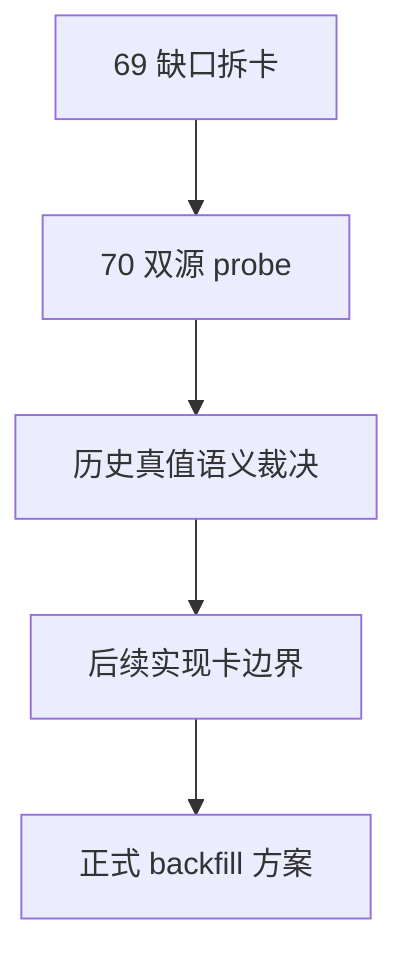

# 历史 objective profile 回补源选型与治理结论

`结论编号：70`
`日期：2026-04-15`
`状态：草稿`

## 裁决

- 接受：
  先把“历史 objective profile 回补 / 覆盖率治理”独立成 `70`，并以 `Tushare / Baostock` 双源 bounded probe 作为下一步正式施工范围。
- 拒绝：
  在未裁清历史时点真值语义前，直接把任何候选源写成正式历史 backfill runner。

## 原因

- `69` 已经证明 objective gate 合同本身成立，但历史 coverage 缺口是独立问题，必须单开治理卡处理。
- 当前 `TdxQuant get_stock_info(...)` 更像当前观测快照接口，尚未证明能提供历史时点真值。
- `Tushare` 与 `Baostock` 都显示出潜在帮助，但两者的历史能力、字段覆盖、权限门槛和账本化适配度还没有经过正式 bounded probe。

## 影响

- `70` 成为当前待施工卡，`80-86` 继续后移，等待 source-selection 结论收口。
- 后续正式实现必须先回答“哪些字段可历史回补、哪些字段只能从现在开始积累”，再决定是否新增正式 objective 历史账本。

## 结论结构图

