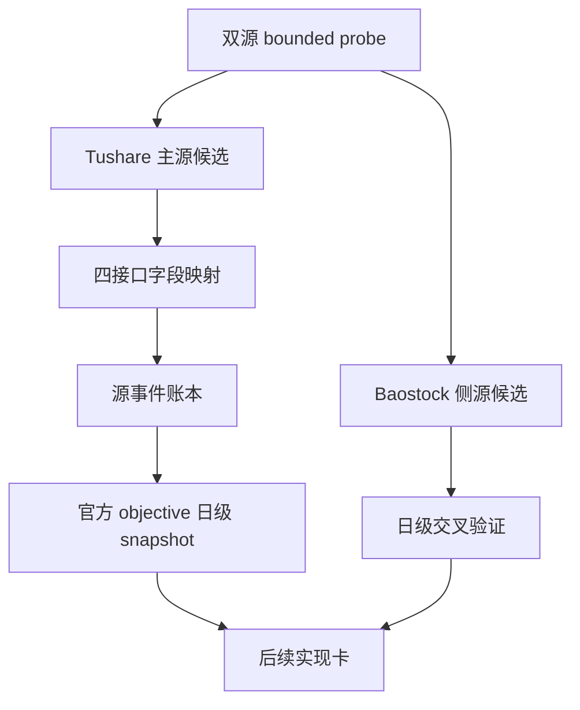

# 历史 objective profile 回补源选型与治理结论
`结论编号：70`
`日期：2026-04-15`
`状态：草稿`

## 裁决

- 接受：
  将 `Tushare` 暂定为历史 objective profile 回补的主源候选，后续实现卡按 `stock_basic + suspend_d + stock_st + namechange` 的组合路径推进。
- 接受：
  后续正式实现优先采用“两层账本”结构：
  - `raw_market.tushare_objective_run / request / checkpoint / event`
  - `raw_market.raw_tdxquant_instrument_profile`
- 接受：
  将 `Baostock` 暂定为日级状态快照与交叉验证侧源，不作为完整历史主源。
- 拒绝：
  直接把 `Baostock` 当作完整 universe / 北交所 / 历史 objective 真值主源。
- 拒绝：
  在未证明历史时点能力前，把 `TdxQuant get_stock_info(...)` 当作历史回补主源。

## 原因

- `Tushare stock_basic` 已实测覆盖上市中、退市、北交所样本，适合承担 universe / `market_type` / `security_type` / `list_status` / `delist_date` 主数据。
- `Tushare suspend_d` 已实测能覆盖 `2010-01-04` 的停复牌记录，满足当前最小缺口窗口的停牌事件需求。
- `Tushare stock_st` 当前账号可用，但官方文档明确其数据从 `20160101` 开始，因此不能单独覆盖 `2010-2015` 的 ST 历史。
- `Tushare namechange` 可返回带 `start_date / end_date / change_reason` 的历史名称区间，样本中已出现 `ST`、`撤销ST`、`*ST`，可作为 `2010-2015` 段的重要补充来源。
- `Baostock` 虽能提供 `tradestatus / isST` 日级快照，但 `query_all_stock(day)` 未覆盖 ETF / BJ，`query_stock_basic` 与 `query_history_k_data_plus` 也不支持 `bj.*`，因此不具备完整主源条件。
- 采用“源事件账本 -> 官方消费快照”两层结构，可以同时满足历史回补、未来日更、checkpoint 续跑和 `filter` 的只读消费边界。

## 影响

- 下一张正式实现卡不应再做泛化 probe，而应直接进入：
  - `Tushare objective source runner / schema`
  - `objective event -> raw_tdxquant_instrument_profile` materialization
- `raw_tdxquant_instrument_profile` 当前仍沿用现名，后续如需改为 source-neutral 名称，必须单开合同升级卡。
- `Baostock` 更适合作为校验层：
  - 验证 `tradestatus`
  - 验证 `isST`
  - 对照 `Tushare` 物化后的日级结果

## 当前未决点

1. `Tushare namechange` 存在重复行，后续实现要先定义去重规则。
2. 需要确认 `2010-2015` 的 ST 历史是否仅靠 `namechange` 已足够，还是还要补别的事件源。
3. 需要为 `Tushare` 接口权限与 token 管理补正式运行时契约。
4. 需要明确 `delisting_arrangement` 的最小判定规则，避免把名称前缀直接误当成完整事实。

## 结论结构图

