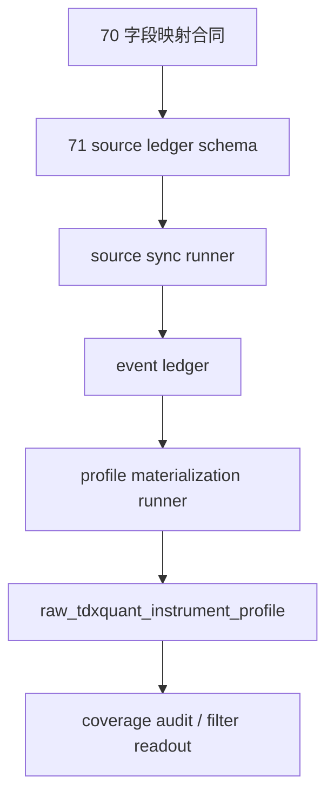

# Tushare objective source runner 与 objective profile materialization
`卡片编号：71`
`日期：2026-04-15`
`状态：草稿`

## 需求

- 问题：
  `70` 已完成主源选型与字段映射，但真实官方库仍没有可供 `filter` 消费的历史 objective coverage。当前缺的是正式实现，而不是进一步 probe。
- 目标结果：
  新增 `Tushare objective source runner/schema`，并把 `tushare_objective_event` 有边界地物化为 `raw_tdxquant_instrument_profile`，打通 `filter` 的历史 objective 上游。
- 为什么现在做：
  如果不把 `70` 的合同落实成正式 runner / schema，`69` 暴露出来的 `2010-01-04 -> 2026-04-08` coverage 缺口就无法进入真实治理闭环，`78-84` 也缺少可信 objective 上游。

## 设计输入

- 设计文档：
  - `docs/01-design/modules/data/07-historical-objective-profile-backfill-source-selection-and-governance-charter-20260415.md`
  - `docs/01-design/modules/data/08-tushare-objective-source-ledger-and-profile-materialization-charter-20260415.md`
- 规格文档：
  - `docs/02-spec/modules/data/07-historical-objective-profile-backfill-source-selection-and-governance-spec-20260415.md`
  - `docs/02-spec/modules/data/08-tushare-objective-source-ledger-and-profile-materialization-spec-20260415.md`
  - `docs/02-spec/modules/filter/01-filter-formal-snapshot-spec-20260409.md`
- 已生效结论：
  - `docs/03-execution/69-filter-objective-tradability-and-universe-gate-freeze-conclusion-20260415.md`
  - `docs/03-execution/70-historical-objective-profile-backfill-source-selection-and-governance-conclusion-20260415.md`

## 任务分解

1. bootstrap 与 schema
   - 新增 source ledger 与 materialization ledger 表族。
   - 补齐 `raw_tdxquant_instrument_profile` 所需字段与约束。
2. source sync runner
   - 落地 `run_tushare_objective_source_sync(...)` 与 CLI。
   - 支持 `stock_basic / suspend_d / stock_st / namechange` 的 bounded sync 与 checkpoint。
3. profile materialization runner
   - 落地 `run_tushare_objective_profile_materialization(...)` 与 CLI。
   - 支持 event -> profile 的 bounded bootstrap、局部 replay 与 run readout。
4. 测试与证据
   - 单测覆盖映射、去重、优先级与 materialization 决策。
   - bounded smoke 与真实 readout 证明历史 coverage 已开始回补。

## 实现边界

- 范围内：
  - `src/mlq/data` 对应 bootstrap / runner / support
  - `scripts/data/run_tushare_objective_source_sync.py`
  - `scripts/data/run_tushare_objective_profile_materialization.py`
  - `tests/unit/data` 对应单测
  - `docs/01-design/modules/data/08-*`
  - `docs/02-spec/modules/data/08-*`
  - `docs/03-execution/71-*`
- 范围外：
  - `Baostock` 正式入库
  - `filter` 层逻辑改写
  - source-neutral 改表名
  - 更高阶退市整理语义治理

## 历史账本约束

- 实体锚点：正式 objective 历史账本与消费快照都锚定 `asset_type + code`。
- 业务自然键：source event 使用 `asset_type + code + source_api + objective_dimension + effective_start_date + source_record_hash`，profile snapshot 使用 `asset_type + code + observed_trade_date`。
- 批量建仓：`stock_basic` 按 `exchange + list_status` 批量，`suspend_d / stock_st` 按交易日窗口，`namechange` 按 bootstrap universe 标的批量，materialization 按 `asset_type + code + observed_trade_date` bounded window 物化。
- 增量更新：`suspend_d / stock_st` 每日增量，`stock_basic` 低频刷新，`namechange` 定向刷新，profile 只重算受影响窗口。
- 断点续跑：source sync 维护 `exchange_status / trade_date / instrument` 三类 checkpoint，materialization 维护 `asset_type + code + observed_trade_date` 级 checkpoint。
- 审计账本：本卡必须补齐 `tushare_objective_run / request / checkpoint / event`、`objective_profile_materialization_run / checkpoint / run_profile` 与 `raw_tdxquant_instrument_profile` readout。

## 收口标准

1. `08` 的 design/spec 已补齐并通过治理检查。
2. `Tushare objective source` schema 与 `profile materialization` schema 已正式落地。
3. 两个 runner 与 CLI 已落地，并支持 bounded window 或 checkpoint queue 二选一调用。
4. 单测、bounded smoke、真实 readout、coverage audit 证据齐全。
5. evidence / record / conclusion 写完，且能说明 `69` 缺口已开始下降。

## 卡片结构图

