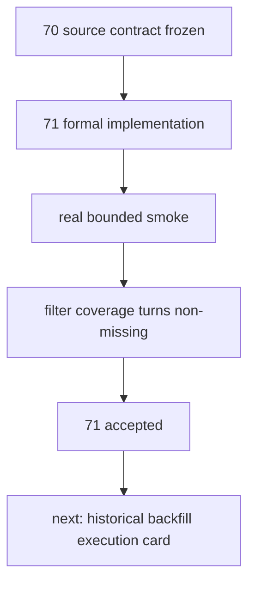

# Tushare objective source runner 与 objective profile materialization 结论
`结论编号：71`
`日期：2026-04-15`
`状态：接受`

## 裁决

- 接受：`71` 已完成 `Tushare objective source ledger + objective profile materialization` 的最小正式实现。
- 接受：正式入口冻结为：
  - `run_tushare_objective_source_sync(...)`
  - `run_tushare_objective_profile_materialization(...)`
- 接受：`raw_tdxquant_instrument_profile` 继续作为 `filter` 当前只读消费的 objective profile 合同名，本卡不做 source-neutral 改名。
- 拒绝：在 `71` 内继续扩 probe 或继续讨论源选型；该问题已在 `70` 收口。
- 拒绝：把历史全窗口回补直接塞回 `71`；本卡只负责最小正式实现与 bounded smoke，不负责整段历史回补执行。

## 原因

- `70` 已经把主源、字段映射与两层账本形态裁清，`71` 的职责就是把这份合同真正落成代码与正式账本。
- 当前 `filter` 需要的是可只读消费的历史 objective profile，而不是继续堆积 source probe 观察。
- 本卡的最小验收标准已经满足：
  - 正式 schema / bootstrap 已落地
  - 两个正式 runner 与 CLI 已落地
  - 单测与治理检查已通过
  - 真实正式库 bounded smoke 已跑通
  - bounded smoke 窗口内 objective missing 已从 `100% missing` 下降到 `0 missing`

## bounded smoke 结论

- smoke window：
  - `2026-04-01 -> 2026-04-08`
- smoke instruments：
  - `000001.SZ`
  - `000002.SZ`
- source sync：
  - `run_id = smoke-tushare-source-20260415a`
  - `21` 个 request 全部完成
  - 正式写入 `2` 条 event
- profile materialization：
  - `run_id = smoke-tushare-profile-20260415a`
  - 正式写入 `10` 条 profile
- filter coverage audit：
  - `filter_snapshot_count = 2`
  - `covered_objective_count = 2`
  - `missing_objective_count = 0`
  - `missing_ratio = 0.0`

## 风险与保留项

- 真实 smoke 暴露过一次 scope-filter bug：
  - `suspend_d / stock_st` 初版没有按 `instrument_list` 过滤
  - 已修复、补测，并定向清理了该次错误 smoke run 的 source 账本产物
- 当前 smoke 只覆盖了很小的真实窗口，尚不能等同于历史全窗口回补完成。
- `Tushare stock_st / namechange / suspend_d` 在更大历史窗口上的真实覆盖边界，仍需通过后续 bounded 扩窗或正式回补卡继续审计。

## 下一步

- 下一步不再回到 probe。
- 应在 `71` 收口后，二选一决策：
  - 方案 A：先扩大 bounded smoke window，逐段把 `2010-01-04 -> 2026-04-08` 切成若干正式 bounded 批次验收
  - 方案 B：直接单开“历史 objective profile 回补执行卡”，按正式批次推进全窗口 backfill

当前更推荐方案 B：单开实现/执行卡，把历史回补窗口、批次切分、checkpoint 续跑、coverage readout 与 evidence 回填一起纳入正式执行闭环。

## 结论结构图

